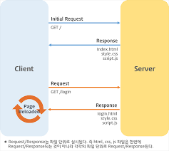
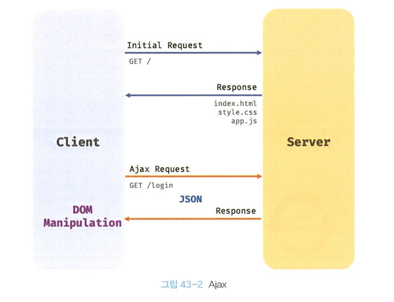
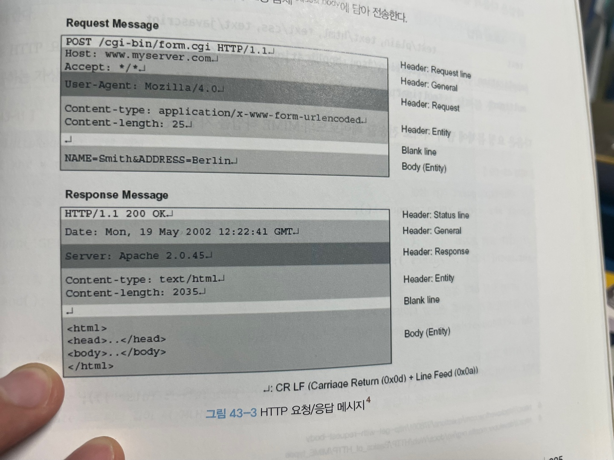

# Chapter43 : Ajax

## Ajax란?
Ajax(Asnchronous JavaScript and XML)란 JS를 사용하여 브라우저가 서버에게 비동기 방식으로 데이터를 요청하고, 서버가 응답한 데이털르 수신하여 웹페이지를 동적으로 갱신하는 프로그래밍 방식을 말한다.   
Ajax는 브라우저에서 제공하는 Web API인 XMLHttpRequest 객체를 기반으로 동작한다.
XMLHttpRequest는 비동기 통신을 위한 메서드와 프로퍼티를 제공한다.

전통적인 웹피이지의 생명 주기는 다음과 같다.   
   
단점은 다음과 같다. 
1. 이전 웹페이지와 차이가 없어서 변경할 필요가 없는 부분까지 포함된 완전한 HTML을 서버로부터 매번 다시 전송받기 때문에 불필요한 데이터 통신이 발생
2. 변경할 필요가 없는 부분까지 처음부터 다시 렌더링. 이로 인해 화면이 순간적으로 깜빡이는 현상 발생
3. 클라이언트와 서버와의 동기 방식으로 동작하므로, 서버로부터 응답이 있을 때까지 다음 처리는 블로킹된다.

Ajax의 등작은 전통적인 패러다임을 획기적으로 전환했다. 웹페이지 변경이 필요한 부분만 비동기 방식으로 전송받아 변경이 필요한 부분만 한정적으로 렌더링하는 방식이 가능해진 것이다.  
  
Ajax의 장점은 다음과 같다.
- 1. 변경할 부분을 갱신하는 데 필요한 데이터만 서버로부터 전송받기 때문에 불필요한 데이터 통신 발생 x
- 2. 변경할 필요가 없는 부분은 다시 렌더링 x. 따라서 화면이 순간적으로 깜박이는 현상 발생 x
- 3. 클라이언트와 서버와의 통신이 비동기 방식으로 동작하기 때문에 서버에게 요청을 보낸 이후 블로킹이 발생하지 않는다.

## JSON(JavaScript Object Notation)
JSON은 클라이언트와 서버 간의 HTTP 통신을 위한 텍스트 데이터 포맷이다. JS에 종속되지 않는 언어 독립형 데이터 포맷으로, 대부분의 프로그래밍 언어에서 사용할 수 있다.
### JSON 표기 방식
- JSON은 JS의 객체 리털과 유사하게 키와 값으로 구성된 순수한 텍스트다.  
- JSON의 키는 반드시 큰따옴표(작은따옴표 사용 불가)로 묶어야 한다.  
- 값은 객체 리터럴과 같은 표기법 그대로 사용 가능

### JSON.stringify
JSON.stringify 메서드는 객체, 배열을 JSON 포맷의 문자열로 변환한다.   
클라이언트가 서버로 객체를 전송하려면 객체를 문자열화해야 하는데 이를 직렬화(serializing)라 한다.

### JSON.parse
JSON 포맷의 문자열을 객체로 변환한다.  
서버로부터 클라이언트에게 전송된 JSON 데이터는 문자열이므로, 이를 객체로서 사용하려면 JSON 포맷의 문자열을 객체화해야 하는데 이를 역직렬화(deserializing)라 한다.   
배열일 경우 문자열을 배열 객체로 변환한다.

## XMLHttpRequest 
브라우저는 주소창이나 HTML의 form 태그, a 태그를 통해 HTTP 요청 전송 기능을 기본 제공한다.  
JS를 사용하여 HTTP 요청을 전송하려면 XMLHttpRequest 객체를 사용한다. 

### XMLHttpRequest 객체 생성
XMLHttpRequest 객체는 XMLHttpRequest 생성자 함수를 호출하여 생성한다.  
XMLHttpRequest객체는 브라우저에서 제공하는 Web API이므로 브라우저 환경에서만 정상적으로 실행된다.
```js
//XMLHttpRequest 객체의 생성
const xhr = new XMLHttpRequest();
```

### XMLHttpRequest 객체의 프로퍼티와 메서드 
#### XMLHttpRequest 객체의 프로토타입 프로퍼티
|프로토타입 프로퍼티 | 설명 |
|:-------------:|:-------:|
|readyState| Http 요청의 현재 상태를 나타내는 정수. UNSENT: 0, OPENED: 1, HEADERS_RECEIVED: 2, LOADING: 3, DONE: 4 |
|status | HTTP 요청에 대한 응답상태(200등)을 나타내는 정수 |
|statusText | HTTP 요청에 대한 응답 메시지를 나타내눈 문자열("OK") |
|responseType | HTTP 응답 타입 |
| response | HTTP 요청에 대한 응답 몸체(response body), responseType에 따라 타입이 다름 |
| responseText | 서버가 전송한 HTTP 요청에 대한 응답 문자열 | 

#### XMLHttpRequest 객체의 이벤트 핸들러 프로퍼티
|이벤트 핸들러 프로퍼티 | 설명 |
|:-------------:|:-------:|
| onreadystatechange | readyState 프로퍼티 값이 변한 경우 |
| onerror | HTTP 요청에 에러가 발생한 경우 |
| onload | HTTP 요청이 성공적으로 완료한 경우 |

#### XMLHttpRequest 객체의 메서드
|메서드 | 설명 |
|:-------------:|:-------:|
| open | HTTP 요청 초기화 | 
| send | HTTP 요청 전송 |
| abort | 이미 전송된 HTTP 요청 중단 |
| setRequestHeader | 특정 HTTP 요청 헤더의 값을 설정 |

### HTTP 요청 전송
HTTP 요청 전송하는 경우 다음 순서를 따른다.
1. XMLHttpRequest.prototype.open 메서드로 HTTP 요청을 초기화한다.
2. 필요에 따라 XMLHttpRequest.prototype.setRequestHeader 메서드로 특정 HTTP 요청의 헤더 값을 설정한다.
3. XMLHttpRequest.prototype.send 메서드로 HTTP 요청을 전송한다.

#### XMLHttpRequest.prototype.open
open 메서드는 서버에 전송할 HTTP 요청을 초기화한다. open 메서드 호출 방법은 다음과 같다.
```js
xhr.open(method, url[. async])
```
| 매개변수 | 설명 |
|:-------------:|:-------:|
| method | HTTP 요청 메서드(GET, POST, PUT, DELETE 등) | 
| url | HTTP 요청을 전송할 URL | 
| async| 비동기 요청 여부 기본값은 true|

HTTP 요청 메서드는 클라이언트가 서버에게 요청의 종류와 목적(리소스에 대한 행위)를 알리는 방법으로 주로 5가지 요청 메서드를 사용하여 CRUD를 구현한다.
| HTTP 요청 메서드 | 종류 | 목적 | 페이로드 |
|:-------------:|:-------:|:--------:|:---------:|
| GET | index/retrieve | 모든/특정 리소스 취득 | X |
| POST | create | 리소스 생성 | O |
| PUT | replace | 리소스의 전체 교체 | O |
| PATCH | modify | 리소스의 일부 수정 | O |
| DELETE | delete | 모든/특정 리소스 삭제 | X |

#### XMLHttpRequest.prototype.send
send 메서드는 open 메서드로 초기화된 HTTP 요청을 서버에 전송한다. 기본적으로 서버로 전송하는 데이터는 GET, POST 요청 메서드에 따라 전송 방식에 차이가 있다.
- GET 요청 메서드의 경우 데이터를 URL의 일부분인 쿼리 문자열로 서버에 전송한다.
- POST 요청 메서드의 경우 데이터(페이로드)를 요청 몸체(request body)에 담아 전송한다.
  
- 페이로드가 객체인 경우 반드시 JSON.stringify 메서드를 사용하여 직렬화한 다음 전달해야 한다.

#### XMLHttpRequest.prototype.setRequestHeader
setRequestHeader 메서드는 특정 HTTP 요청의 헤더 값을 설정한다. setRequestHeader 메서드는 반드시 open 메서드를 호출한 이후에 호출해야 한다.   
자주 사용하는 HTTP 요청 헤더인 Content-type과 Accept를 보자  
Content-type은 요청 몸체에 담아 전송할 데이터의 MIME(Multipurpose Internet Mail Extensions) 타입의 정보를 표현한다. 자주 사용하는 MIME 타입은 다음과 같다. 
| MIME 타입 | 서브타입 |
|:-------------:|:-------:|
| text | text/plain, text/html, text/css, text/javascript |
| application | application/json, application/x-www-form-urlencode | 
| multipart | multipart/formed-data | 

HTTP 클라이언트가 서버에 요청할 때 서버가 응답할 데이터의 MIME 타입을 Accept로 지정할 수 있다.  
만약 Accept 헤더를 설정하지 않으면 send 메서드가 호출될 때 Accept 헤더가 */*으로 전송된다.

### HTTP 응답 처리
readyState 프로퍼티 값이 변경된 경우 발생하는 readystatechange 이벤트를 캐치하여 다음과 같이 HTTP 응답을 처리할 수 있다. 
```js
if (xhr.readyState !== XMLHttpRequest.DONE) return;

if (xhr.status === 200) {
    console.log(JSON.parse(xhr.response));

} else {
    console.error('Error', xhr.status, xhr.statusText);
};
```
readystatechange 이벤트 대신 load 이벤트를 캐치해도 좋다. load 이벤트는 HTTP 요청이 성공적으로 완료된 경우 발생한다.

## Questions
- Ajax 와 전통적인 웹페이지 생명주기의 차이에 대해서 설명해보세요.
- JSON 에 대해 설명해보세요.
