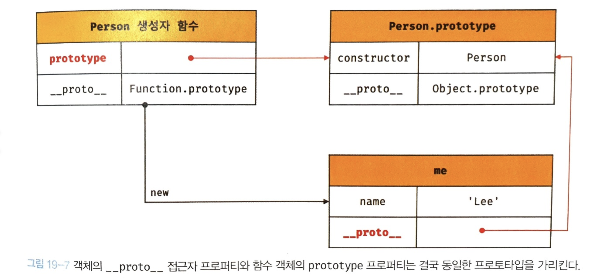
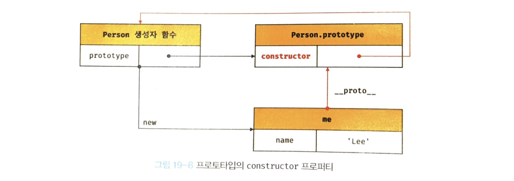

# chapter 19 : prototype
자바 스크립트는 객체 기반의 프로그래밍 언어이며 원시 타입의 값을 제외한 나머지 값들은 모두 객체이다.
## 객체지향 프로그래밍

객체 : 속성을 통해 여러 개의 값을 하나의 단위로 구성한 복합적인 자료구조  
객체지향 프로그래밍 : 전통적인 명령형 프로그래밍의 절차지향적 관점에서 벗어나 객체의 집합으로 프로그램을 표현하려는 프로그래밍 패러다임  
객체지향 프로그래밍은 객체의 상태(state)와 동작(behavior)을 하나의 논리적인 단위로 묶어 생각한다.  
즉 이러한 관점에서 객체는 **상태 데이터와 동작을 하나의 논리적인 단위로 묶은 복합적인 자료구조**라고 할 수 있다.  
이 때의 상태 데이터 = property, 동작 = method 이다.
## 상속과 프로토타입
상속 : 객체지향 프로그램의 핵심 개념, 어떤 객체의 프로퍼티 또는 메서드를 다른 객체가 상속받아 그대로 사용할 수 있는 것  
js는 프로토타입 기반 상속 구현.  
생성자로 인스턴스 만들 시 불필요한 메서드가 중복 생산될 수 있으나, 프로토타입으로 선언 시 중복을 제거할 수 있다.
## 프로토타입 객체
프로토타입 객체 : 객체 간 상속을 구현하기 위해 사용  
상위 객체는 공유 프로퍼티(메서드 포함)을 제공, 하위 프로퍼티는 자유롭게 사용 가능   
모든 객체는 [[Prototype]]이라는 내부 슬롯을 가지며, 프로토타입의 참조를 가진다. 이 값은 객체 생성 방식에 의해 결정된다.  
  
모든 객체는 하나의 프로토타입을 가지며, 모든 프로토타입은 생성자 함수와 연결되어 있다.  
생성자 함수는 자신의 prototype 로퍼티를 통해, 프로토타입은 자신의 constructor 프로퍼티를 통해 생성자 함수에 접근할 수 있다.
### ```__proto__``` 접근자 프로퍼티
[[Prototype]] 내부 슬롯에 간접적 접근을 ```__proto__```(접근자 프로퍼티, getter/setter)를 통해 함.  
Object.prototype의 프로퍼티로 모든 객체는 상속을 통해 ```__proto__```사용 가능  

#### ```__proto__```를 사용하는 이유
상호 참조에 의해 프로토타입 체인이 생성되는 것을 방지하기 위해.

#### ```__proto__``` 접근자 프로퍼티를 코드 내에서 직접 사용하는 것은 권장하지 않음.
```__proto__```는 ES6부터 브라우저 호환성을 고려하여 표준 채택  
모든 객체가 ```__proto__```를 사용할 수 있진 않기 때문에 사용 권장 X  
직접 상속을 통해 Object.prototype 상속받지 않는 객체 생성이 가능 함. 이 경우 ```__proto__``` 사용 불가.  
<br/>
프토토타입 참조 취득 시 Object.getPrototypeOf, 교체 시 Object.setPrototypeOf 메서드 사용 권장.  

### 함수 객체의 prototype 프로퍼티  
함수 객체만이 소유하는 prototype 프로퍼티는 생성자 함수가 생성할 인스턴스의 프로토타입을 가리킨다.    
non-constructor(화살표 함수 ES6 메서드 축약 표현 정의 메서드)는 prototype 프로퍼티 소유 x, 프로토타입도 생성 x.  
```__proto__```와 함수 객체만의 prototype은 결국 동일한 프로토타입을 가리킴. 하지만 사용하는 주체는 조금 다름.  
```__proto__``` => 모든 객체 : 객체가 자신의 프로토타입에 접근, 교체에 사용  
prototype => 생성자 함수 : 자신이 생성할 객체(인스턴스)의 프로토타입을 할당하기 위해 사용  
  
### 프로토타입의 constructor 프로퍼티와 생성자 함수
모든 프로토타입은 자신을 참조하고 잇는 생성자 함수를 가리키는 constructor 프로퍼티를 가짐.    

## 리터럴 표기법에 의해 생성된 객체의 생성자 함수와 프로토타입
Object 생성자 함수 호출과 객체 리터럴의 평가는 추상 연산 OrdinaryObejctCreate를 호출하여 빈 객체를 생성하는 점에서 동일하나 new.target의 확인이나 프로퍼티를 추가하는 처리 등 세부 내용은 다르다.  
함수 객체는 생성자 함수로 만들면 렉시컬 스코프 및 클로저를 만들지 않고, 선언문, 표현식의 경우에는 만든다.  

이렇듯 차이를 보이지만, 프로토타입과 생성자 함수는 단독으로 존재할 수 없고 언제나 쌍으로 존재한다.
큰 틀에서 보면 생성자 함수와 리터럴 표기법으로 생산한 객체를 생성한 생성자 함수로 생각해도 무리는 없다.  

## 프로토타입의 생성 시점
프로토타입은 생성자 함수가 생성되는 시점에 더불어 생성된다.
### 사용자 정의 생성자 함수와 프로토타입 생성 시점
- constructor는 함수 정의가 평가되어 함수 객체를 생성하는 시점에 프로토타입도 더불어 생성된다.   
- non-constructor는 프로토타입이 생성되지 않는다.  
- 함수 선언문은 런타임 이전에 js 엔진에 의해 먼저 실행되고, 이 때 생성된 프로토타입은 생성자 함수의 prototype 프로퍼티에 바인딩된다.  
- 생성된 프로토타입의 프로토타입은 언제나 Object.prototype
### 빌트인 생성자 함수와 프로토타입 생성 시점
- Object, String, Number, Function, Array, RegExp, Date, Promise 등과 같은 빌트인 생성자 함수도 일반 함수와 마찬가지로 빌트인 생성자 함수가 생성되는 시점에 프로토타입 생성  
- 모든 빌트인 생성자 함수는 전역 객체 생성 시점에 생성. (빌트인 생성자 함수의 prototype 프로퍼티에 바인딩)  
- 생성자 함수 또는 리터럴 표기법으로 객체 생성시 프로토타입은 생성된 객체의 [[Prototype]] 내부 슬롯에 할당된다.
### 객체 생성 방식과 프로토타입의 결정


## Questions
- 함수 객체의 prototype과 일반 객채의 __proto__는 어떻게 다른가요?
- Function 생성자 함수를 통해 함수를 만든 것과 함수 표현식이나 함수 선언문을 사용하여 만든 함수는 어떻게 다른가요?