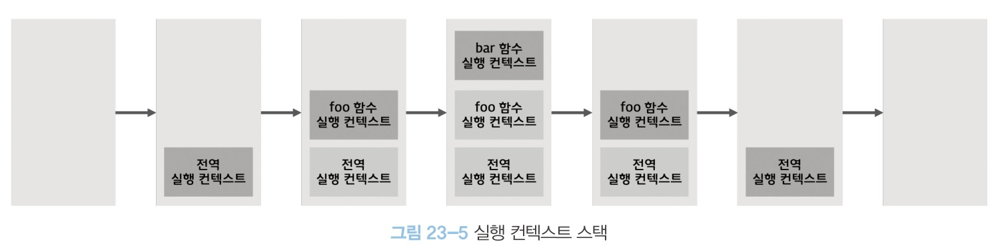

# chapter23 : 실행 컨텍스트
execution context(실행 컨텍스트)는 JS 동작 원리를 담고 있는 핵심 개념이다.

## 소스코드의 타입
ECMAScript 사양은 소스코드를 4가지 타입으로 구분. 이들은 실행 컨텍스트 생성
1. global code : 전역 존재 소스코드
2. function code : 함수 내부 존재 소스코드
3. eval code : : 빌트인 전역 함수eval 함수에 인수로 전달되어 실행되는 소스코드
4. module code : 모듈 내부 존재 소스코드. 모듈 내부 함수, 클래스 등 내부 코드 포함 x

#### 전역 코드
전역 변수 관리 위해 최상위 스코프인 전역 스코프 생성. var 키워드로 선언된 전역 변수와 함수 선언문으로 정의된 전역 함수를 전역 객체의 프로퍼티와 메서드로 바인딩하고 참조하기 위해 전역 객체와 연결되어야 함. 이를 위해 전역 코드가 평가되면 전역 실행 컨텍스트 생성

### 함수 코드
지역 변수, 매개변수 arguments 객체 관리하는 지역 스코프 생성. 함수 코드 평가시 실행 컨텍스트 생성

### eval 코드
strict mode에서 자신만의 독자적 스코프 생성. eval 코드 평가 시 eval 실행 컨텍스트 생성

### 모듈 코드
모듈 코드는 모듈별로 독립적 모듈 스코프 생성. 평가 시 모듈 실행 컨텍스트 생성

## 소스코드의 평가와 실행
- JS 엔진은 소스코드의 평가와 소스코드의 실행 과정으로 나누어 처리
- 평가 과정에서는 실행 컨텍스트 생성, 변수, 함수 등의 선언문만 먼저 실행하여 생성된 변수나 함수 식별자를 키로 실행 컨텍스트가 관리하는 스코프(렉시컬 환경의 환경 레코드)에 등록
- 평가 과정 이후 순차적으로 실행 (런타임 시작) 
- 변수나 함수 참조는 실행 컨텍스트 관리 스코프에서 검색해서 취득
- 변수 값의 변경 등 소스코드 실행 결과는 실행 컨텍스트가 관리하는 스코프에 등록
  

var x는 먼저 실행하여 실행 컨텍스트가 관리하는 스코에 등록되고 undefined로 초기화  
소스코드 평가 후 실행. 선언문은 평가 시 실행되었으므로 할당문 x =1만 실행. 

## 실행 컨텍스트의 역할
```js
const x = 1;
const y = 2;

function foo(a) {
    const x = 10;
    const y = 20;

    console.log(a + x+ y) //130
}

foo(100);

console.log(x + y);
```
코드 실행은 다음과 같다  
전역 코드 평가 -> 전역 코드 실행 -> 함수 코드 평가 -> 함수 코드 실행
### 전역코드 평가
- 전역 코드 실행 준비를 함. 
- 소스코드 평가 과정에서 선언문만 먼저 실행
- 전역 코드 변수 선언문과 함수 선언문이 먼저 실행되고, 그 결과 생성된 전역 변수와 전역 함수가 실행 컨텍스트 관리하는 전역 스코프에 등록
- 이 때 var 키워드 선언 전역 변수, 함수 선언문으로 정의된 전역 함수는 전역 객체의 프로퍼티와 메서드가 된다.

### 전역 코드 실행
순차적으로 코드 실행하며 값 할당, 함수 호출 등 진행 하며 함수 호출시, 전역 코드 실행이 일시 중단되고 코드 실행 순서 변경 함수 내부로 진입한다.

### 함수 코드 평가
- 전역코드와 비슷한 평가과정을 함수 내부에 대해서 똑같이 진행
- 이 때 전역 스코프가 아닌 지역 스코프에 등록. 
- arguments 객체 생성되어 지역 스코프에 등록되고 this 바인딩 결정

### 함수 코드 실행
차례대로 함수 코드 실행. 이 경우에는 console.log메서드를 호출하는데, console을 스코프 체인을 통해 검색. 그 후 log 프로퍼티를 console 객체의 프로토타입 체인을 통해 검색.   
-> 스코프 구분하여 식별자와 바인딩된 값이 관리되어야 함.

이 모든 것을 관리하는 것이 실행 컨텍스트.   
실행 컨텍스트 : 식별자(변수, 함수, 클래스 등의 이름)을 등록하고 관리하는 스코프와 코드 실행 순서 관리를 구현한 내부 매커니즘으로, 모든 코드는 실행 컨텍스트를 통해 실행되고 관리된다.

## 실행 컨텍스트 스택
전역 진행 중 함수 호출 시 함수 실행 컨텍스트 생성  
ex)
```js
const x = 1;

function foo () {
    const y = 2;

    function bar () {
        const z = 3;
        console.log(x + y+ z);
    }
    bar();
}

foo(); //6
```

이 때 실행 컨텍스트는 스택 자료구조로 관리. 이를 실행 컨텍스트 스택이라고 부름
  

진행은 다음과 같다.  
1. 전역 코드의 평가와 실행
2. foo 함수 코드의 평가와 실행
3. bar 함수 코드의 평가와 실행
4. foo 함수 코드 복귀
5. 전역 코드로 복귀  

실행 컨텍스트 스택 최상위 실행 컨텍스트는 언제나 현재 실행 중인 코드의 실행 컨텍스트

### 렉시컬 환경
렉시컬 환경 : 식별자와 식별자에 바인딩된 값, 그리고 상위 스코프에 대한 참조를 기록하는 자료구조로 실행 컨텏스트를 구성하는 컴포넌트  
실행 컨텍스트 스택 -> 코드 실행 순서 관리, 렉시컬 환경 -> 스코프와 식별자 관리  
- 렉시컬 환경은 키와 값을 갖는 객체 형태의 스코프(전역, 함수, 블록 스코프)를 생성하여 식별자를 키로 등록하고 식별자에 바인딩된 값을 관리. 즉 저장소라 볼 수 있다.
- 실행 컨텍스틑 LexicalEnvironment 컴포넌트와 VariableEnvironment 컴포넌트로 구성.
   
- 처음에는 동일한 렉시컬 환경을 참조. 몇몇 경우에 떨어지기도 하지만, 여기서는 구분하지 않고 (strict mode, eval 코드, try/catch 문과 같은 특수 상황 제외) 렉시컬 환경으로 통일해 설명
#### 렉시컬 환경의 구성요소
1. 환경 레코드 : 스코프에 포함된 식별자를 등록하고 등록된 식별자에 바인딩된 값을 관리하는 저장소

2. 외부 렉시컬 환경에 대한 참조 : 상위 스코프를 가리킴. 실행 컨텍스트 생성 소스코드 포함 상위 코드의 렉시컬 환경. 단방향 링크드 리스트인 스코프 체인을 구현

## 실행 컨텍스트의 생성과 식별자 검색 과정

### 전역 객체 생성
- 전역 코드 평가 전 생성. 빌트인 전역 프로퍼티와 빌트인 전역 함수 등이 포함됨.  
- 전역 객체도 Object.prototype 상속
### 전역 코드 평가
생성 후 JS 엔진이 전역 코드 평가. 평가는 다음 순서로
1. 전역 실행 컨텍스트 생성
2. 전역 렉시컬 환경 생서
    - 전역 환경 레코드 생성
        - 객체 환경 레코드 생성
        - 선언적 환경 레코드 생성
    - this 바인딩
    - 외부 렉시컬 환경에 대한 참조 결정
    

- 전역 실행 컨텍스트 생성 : 실행 컨텍스트 스택에 푸쉬
- 전역 렉시컬 환경 생성 : 전역 실행 컨텍스트에 바인딩
- 전역 환경 레코드 생성 : 객체 환경 레코드(var, 함수 선언문으로 정의한 전역 변수, 빌트인 전역 프로퍼티와 빌트인 전역 함수, 표준 빌트인 객체 관리)와 선언적 환경 레코드(let, const로 선언한 전역 변수)로 구성되어 있음.
- 객체 환경 레코드 생성