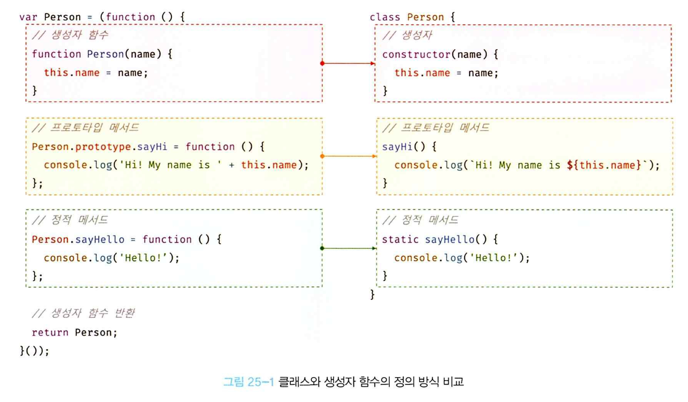
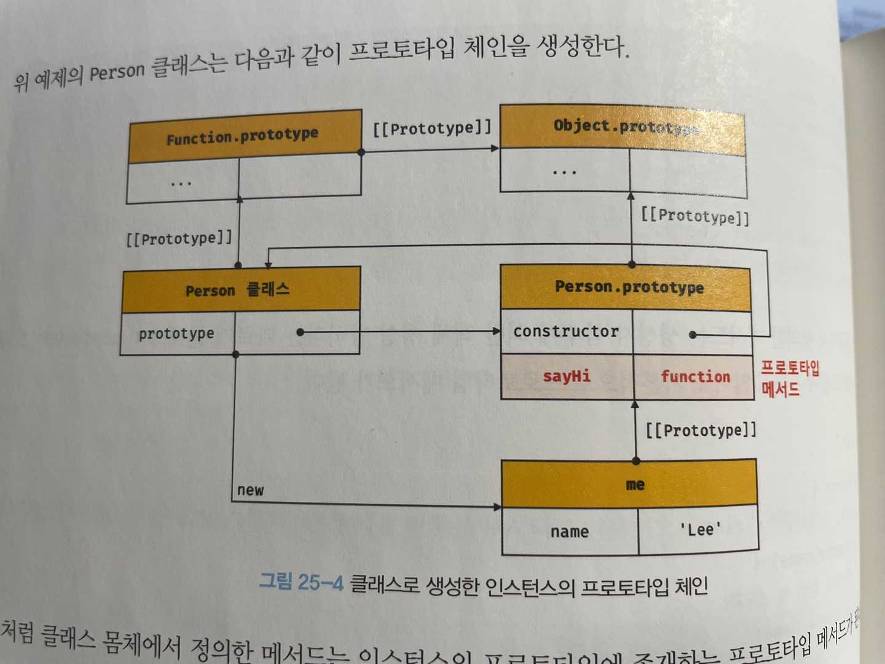
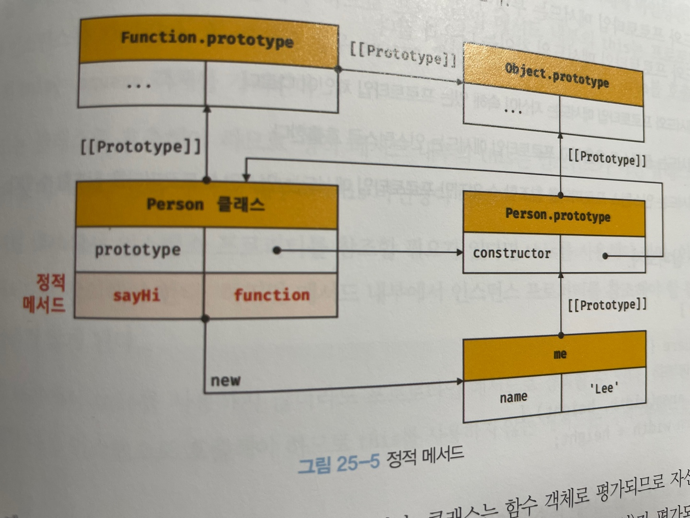
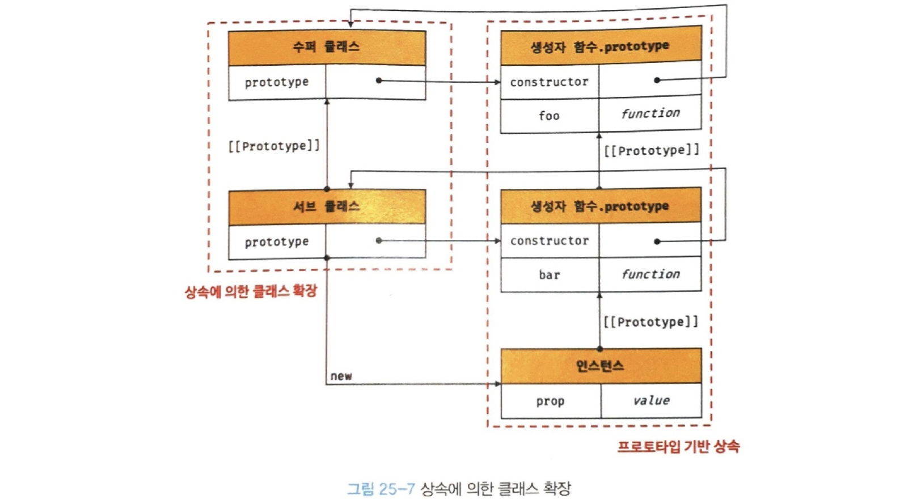
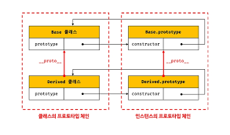

# chapter 25 : 클래스

## 클래스는 프로토타입의 문법적 설탕인가?
자바스크립트는 프로토타입 기반 객체지향 언어다.   
ES5에서는 클래스 없이도 다음과 같이 생성자 함수와 프로토 타입을 통해 객체지향 언어의 상속을 구현할 수 있다.  
단, 클래스와 생성자 함수는 모두 프로토타입 기반의 인스턴스를 생성하지만 정확히 동일하게 동작하지 않는다.  
다음과 같이 몇 가지 차이가 있다.  

1. 클래스를 new 연산자 없이 호출하면 에러가 발생한다. 하지만 생성자 함수를 new 연산자 없이 호출하면 일반 함수로서 호출된다.
2. 클래스는 상속을 지원하는 extends와 super 키워드를 제공한다. 하지만 생성자 함수는 지원하지 않는다.
3. 클래스는 호이스팅이 발생하지 않는 것처럼 동작한다. 하지만 함수 선언문으로 정의된 생성자 함수는 함수 호이스팅이 함수 표현식으로 정의한 생성자 함수는 변수 호이스팅이 발생한다.
4. 클래스 내의 모든 코드에는 암묵적으로 strict mode가 지정되어 실행되며 strict mode 해제가 불가능하다.
5. 클래스의 constructor, 프로토타입 메서드, 정적 메서든느 모두 프로퍼티 어트리뷰트 [[Enumerable]]의 값이 false다. 다시 말해 열겨되지 않는다.

따라서 클래스를 단순한 문법적 설탕이라고 보기보다는 새로운 객체 생성 메커니즘으로 보는것이 좀 더 합당하다.

## 클래스 정의
클래스는 class 키워드를 사용하여 정의한다. 파스칼 케이스가 일반적이지만 사용하지 않아도 에러가 발생하지는 않는다.  
ex)
```js
class Person {}
```
일반적 이지는 않지만 함수와 마찬가지로 표현식으로 클래스를 정의할 수도 있다.
```js
//익명 클래스 표현식
const Person = class {};
//기명 클래스 표현식
const Person = class MyClass {};
```
클래스를 표현식으로 정의할 수 있다는 것은 곧 일급 객체라는 것을 의미한다. 즉 다음과 같은 특징을 갖는다.
- 무명의 리터럴로 생성할 수 있다. 즉 런타임에 생성 가능하다.
- 변수나 자료구조에 저장할 수 있다.
- 함수의 매개변수에게 전달할 수 있다.
- 함수의 반환값으로 사용할 수 있다.
- 즉 클래스는 함수다.

클래스 몸체에는 0개 이상의 메서드만 정의할 수 있다. constructor, 프로토타입 메서드, 정적 메서드 세 가지가 가능하다.  
```js
class Person {

    constructor(name) {
        this.name = name;
    }

    sayHi() {
        console.log(`Hi! My name is ${this.name}`)
    }

    static sayHello() {
        console.log("Hello")
    }
}

const me = new Person('Lee');

console.log(me.name);

me.sayHi();

Person.sayHello();
```



## 클래스 호이스팅
- 클래스는 함수로 평가된다. 
- 클래스 선언문으로 정의한 클래스는 함수 선언문과 같이 소스코드 평가 과정, 즉 런타임 이전에 먼저 평가되어 함수 객체를 생성 (constructor)
- 함수 객체를 생성하는 시점에 프로토타입도 더불어 생성(프로토타입과 생성자 함수는 쌍으로 존재)
- 클래스는 클래스 정의 이전에 참조 불가

```js
const Person = '';

{
    // 호이스팅 발생 x 시 ''이 출력되어야 한다.
    console.log(Person);
    // ReferenceError : Cannot access 'Person' before initialization

    class Person {}
}
```
이와 같이 호이스팅은 발생하나 let, const 처럼 TDZ에 빠지기 때문에 호이스팀이 발생하지 않는 것처럼 동작한다.

## 인스턴스 생성
클래스는 생성자 함수이며 new 연산자와 함께 호출되어 인스턴스를 생성

```js
class Person {}

const me = new Person();
console.log(me); // Person {}
```
함수는 new 연산자 사용 여부에 따라 일반 함수 or 생성자 함수이나, 클래스는 인스턴스 생성이 유일한 존재 이유이므로 반드시 new 연산자와 함께 호출해야 함.

## 메서드
클래스 몸체에서 정의할 수 있는 메서드는 constructor, 프로토타입 메서드, 정적 메서드 세 가지 이다.
### constructor
- 인스턴스 생성 및 초기화 하기 위한 특수 메서드다. 이름 변경이 불가능하다.
```js
class Person {

    constructor(name) {
        this.name = name;
    }
}
```
- constructor 내부의 this는 생성자 함수와 마찬가지로 클래스가 생성한 인스턴스를 가리킨다.
- constructor는 메서드로 해석되는 것이 아니라 클래스가 평가되어 생성한 함수 객체 코드의 일부가 된다.
```
클래스의 constructor 메서드와 프로토타입의 constructor 프로퍼티는 이름은 같지만 관련이 없다.  
프로토타입의 constructor 프로퍼티는 모든 프로토타입이 가지고 잇는 프로퍼티이며, 생성자 함수를 가리킨다.
```
- constructor는 클래스 내 최대 한 개만 존재할 수 있으며, 생략 가능하다. 생략시 빈 constructor에 의해 빈 객체를 생성한다.
- 인스턴스 초기화시 constructor 내부의 this를 통해 초기화 하기 대문에 constructor는 필수이다.
- constructor는 별도의 반환문을 가지지 않아야 한다.
- constructor 내부에서 명시적으로 this가 아닌 값을 반환하면 안된다. 만일 반환시 원시값 -> 무시후 this 반환, this가 아닌 객체시 return 문 명시한 객체가 반환된다.

### 프로토타입 메서드
생성자 함수 사용하여 인스턴스 생성 후 프로토타입 메서드 생성을 위해서는 다음과 같이 해야한다.
```js
function Person(name) {
    this.name = name;
}

Person.prototype.sayHi = function () {
    console.log(`Hi! My name is ${this.name}`);
};

const me = new Person('Lee');
me.sayHi();
```

- 클래스 몸체에서 정의한 메서드는 자동으로 프로토타입 메서드가 된다.
- 생성자 함수와 마찬기졸 클래스가 생성한 인스턴스는 프로토타입 체인의 일원이 된다.

- 위와 같은 이유로 클래스는 생성자 함수와 같이 인스턴스를 생성하는 생성자 함수라고 볼 수 있다.
- 즉 클래스는 생성자 함수와 마찬가지로 프로토타입 기반의 객체 생성 메커니즘이다.

### 정적 메서드
생성자 함수의 경우는 다음과 같이 정적 메서드를 만들었다.
```js
function Person(name) {
    this.name =name;
}
Person.sayHi = function() {
    console.log('Hi!');
}

Person.sayHi();
```

클래스에서는 메서드에 static 키워드를 붙이면 정적 메서드(클래스 메서드)가 된다.
```js
class Person {

    constructor(name) {
        this.name = name;
    }

    static sayHi() {
        console.log('Hi');
    }
}
```
위 예제는 다음과 같이 프로토타입 체인을 생성한다.

즉 정적 메서드는 클래스에 바인딩된 메서드가 된다.  
정적 메서드는 인스턴스로 호출할 수 없다(인스턴스 프로토타입 체인상에 존재 x). 따라서 클래스로 호출해야한다.

### 정적 메서드와 프로토타입 메서드의 차이
차이는 다음과 같다.
- 1. 정적 메서드와 프로토타입 메서드는 자신이 속해 있는 프로토타입 체인이 다르다.
- 2. 정적 메서드는 클래스로 호출하고 프로토타입 메서드는 인스턴스로 호출한다.
- 3. 정적 메서드는 인스턴스 프로퍼티 참조 x 반대는 가능 

표준 빌트인 객체인 Math, Number, JSON, Object, Reflect 등은 다양한 정적 메서드를 가지고 있다.   
이렇게 하면 이름 충돌 가능성을 줄여 주고 관련 함수들을 구조화할 수 있는 효과가 있다. 이런 이유로 애플리케이션 전역에서 사용할 유틸리티 함수를 전역 함수로 정의하지 않고 메서드로 구조화할 때 유용하다.

### 클래스에서 정의한 메서드의 특징
1. function 키워드를 생략한 메서드 축약 표현을 사용
2. 객체 리터럴과는 다르게 클래스에 메서드를 정의할 때는 콤마가 필요 없다.
3. 암묵적으로 strict mode로 실행
4. for ... in문이나 Object.keys 메서드 등으로 열거 불가능.
5. 내부 메서드 [[Construct]]를 갖지 않는 non-construtor다. 따라서 new 연산자와 함께 호출할 수 없다.

## 클래스의 인스턴스 생성 과정
new 연산자와 함께 클래스를 호출하면 생서자 함수와 마찬가지로 클래스의 내부 메서드 [[Construct]]가 호출된다. "생성자 함수의 인스턴스 생성 과정"에서 살펴본 바와 유사하게 다음과 같은 과정을 거쳐 인스턴스가 생성된다.

#### 1. 인스턴스 생성과 this 바인딩
new 연산자와 함께 클래스를 호출하면 constructor 내부 코드가 실행되기에 앞서 암묵적으로 빈 객체가 생성된다. 인스턴스의 프로토타입으로 클래스의 prototype 프로퍼티가 가리키는 객체가 설정된다. 그리고 인스턴스는 this에 바인딩된다.

#### 2. 인스턴스 초기화
constructor의 내부 코드가 실행되어 this에 바인딩되어 있는 인스턴스를 초기화한다.

#### 3. 인스턴스 반환
클래스의 모든 처리가 끝나면 완성된 인스턴스가 바인딩된 this가 암묵적으로 반환된다.

## 프로퍼티
### 인스턴스 프로퍼티
인스턴스 프로퍼티는 constructor 내부에서 정의해야 한다.

### 접근자 프로퍼티
- 접근자 프로퍼티는 자체적으로는 값 [[Value]]을 갖지 않고 다른 데이터 프로퍼티의 값을 읽거나 저장할 때 사용하는 접근자 함수로 구성된 프로퍼티다.  
- getter 함수와 setter 함수로 구성되어 있다.  
- getter는 메서드 이름 앞에 get 키워드를 사용해 정의 (반드시 무언가 반환해야 함)
- setter는 메서드 이름 앞에 set 키워드를 사용해 정의 (반드시 매개변수가 있어야 함)
- getter, setter이름은 인스턴스 프로퍼티처럼 사용
- 즉 getter는 호출하는 것이아니라 프로퍼티처럼 참조하는 형식으로 사용
- 클래스의 메서드는 기본적으로 프로토타입 메서드이므로, 클래스의 접근자 프로퍼티 또한 인스턴스 프로퍼티가 아닌 프로토타입의 프로퍼티가 된다.

## Qustions 
- class와 생성자 함수의 차이에 대해 말해보시오.
- 프로토타입 메서드와 정적 메서드의 차이에 대해 말해보시오.

### 클래스 필드 정의 제안
클래스 기반 객체지향 언어에서 클래스가 생성할 인스턴스의 프로퍼티를 가리키는 용어다.  
자바스크립트의 클래스 몸체에는 메서드만 선언할 수 있다. 따라서
```js
class Person {
    // 클래스 필드 정의
    name = 'Lee';
}

const me = new Person('Lee');
```
따라서 문법 에러가 발생해야 하나 최신 브라우저(Chrome 72 이상), Node.js(버전 12이상)에서 실행하면 정상 작동한다.   
왜냐하면 JS도 인스턴스 프로퍼티를 마치 클래스 기반 객체지향 언어의 클래스 필드처럼 정의할 수 잇는 새로운 표준 사양인 "Class field declarations"가 2021년 1월 TC39 프로세스의 stage3(candidate)에 현재 제안되어 있기 때문이다.
함수는 일급 객체이므로 함수를 클래스 필드에 할당할 수 있다. 
ex
```js
class Person {
    name = 'Lee';

    getName = function () {
        return this.name;
    }
    // 화살표 함수도 가능
}

const me = new Person();
console.log(me); // Person { name: "Lee", getName: f}
console.log(me.getName()); //Lee
```
다만 모든 클래스 필드는 인스턴스 프로퍼티가 되기 때문에 이 함수는 프로토타입 메서드가 아닌 인스턴스 메서드가 된다.    
따라서 클래스 필드에 함수를 할당하는 것은 권장하지 않는다.  

### private 필드 정의 제안
js에서 아직 prviate, public, protected 키워드와 같은 접근 제한자를 지원하지 않기에 언제나 public이다.  
다만 위에서 말한 TC39 프로세스의 stage3에는 private 필드를 정의할 수 있는 새로운 표준 사양이 제안되어 있다.  
private 필드의 선두에는 #, 참조할 때도 #을 붙여주어야 한다.
```js
class Person {

    #name ='';

    constructor(name) {

        this.#name = name;
    }
}

const me = new Person('Lee');

// private 필드 #name은 클래스 외부에서 참조할 수 없다.
console.log(me.#name)
// SyntaxError: Private field '#name' must be declared in an enclosing class
```
직접 접근은 불가하지만 접근자 프로퍼티를 통해 간접적으로 접근하는 방법은 유효하다.  
private 필드를 직접 constructor에 정의하면 에러가 발생하므로 반드시 클래스 몸체에 정의해야 한다.

### static 필드 정의 제안
정적 메서드에서는 static 키워드로 만들 수 있었으나 static 키워드를 사용하여 정적 필드를 정의할 수는 없었다.  
하지만 TC39프로세스의 stage 3에 의해 제안되어 있고, Chrome 72 이상, Node.js 버전 12이상에 이미 구현되어 있다.  

## 상속에 의한 클래스 확장
### 클래스 상속과 생성자 함수 상속
상속에 의한 클래스 확장은 지금까지 살펴본 프로토타입 기반 상속과는 다른 개념이다.    
프로토타입 기반 상속은 프로토타입 체인을 통해 다른 객체의 자산을 상속받는 개념이고,   
**상속에 의한 클래스 확장**은 기존 클래스를 상속받아 새로운 클래스를 확장하여 정의하는 것이다.  
  
클래스는 상속을 통해 다른 클래스를 확장할 수 있는 문법인 extends 키워드가 기본적으로 제공되지만, 생성자 함수는 그와 같은 게 없다.

### extends 키워드
extends 키워드를 사용하여 상속받을 클래스를 정의할 수 있다.
확장된 클래스를 서브 클래스(파생 클래스 ,자식 클래스), 상속된 클래스를 수퍼 클래스(베이스 클래스, 부모 클래스)라고 부른다.  
인스턴스의 프로토타입 체인분 아니라 클래스 간의 프로토타입 체인도 생성한다.  


### 동적 상속
생성자 함수를 상속받아 클래스 확장도 가능하다.  단 extends 앞에는 반드시 클래스가 와야 한다.  
extends 뒤에는 클래스뿐만이 아니라 [[Construct]] 내부 메서드를 갖는 함수 객체로 평가될 수 있는 모든 표현식을 사용할 수 있다.
ex)
```js
function Base1() {}

class Base2() {}

let condition = true;

//조건에 따라 동적으로 상속 대상을 결정하는 서브클래스
class Derived extends (condition ? Base1 : Base2) {}

const derived = new Derived();
console.log(derived);

console.log(derived instanceof Base1); // true
console.log(derived instanceof Base1); // false
```

### 서브클래스의 constructor
서브클래스에서 constructor를 생략하면 암묵적으로 다음과 같이 정의된다.
```js
constructor(...args) { super(...args);}
```
super()는 수퍼클래스의 constructor(super-constructor)를 호출하여 인스턴스를 생성한다.  

### super 키워드
함수처럼 호출할 수도 있고 this와 같이 식별자처럼 참조할 수 있는 특수한 키워드. super 동작은 다음과 같다.
- super를 호출하면 수퍼클래스의 constructor(super-constructor)를 호출
- super를 참조하면 수퍼클래스의 메서드를 호출할 수 있다.

#### super 호출
super를 호출할 때 주의사항은 다음과 같다.
- 서브클래스에서 constructor를 생략하지 않는 경우 반드시 super를 호출해야 한다.
- 서브클래스의 constructor에서 super를 호출하기 전에는 this를 참조할 수 없다.
- super는 반드시 서브클래스의 constructor에서만 호출. 다른 곳에서 호출시 에러 발생

#### super 참조
메서드 내에서 super를 참조하면 수퍼클래스의 메서드를 호출할 수 있다.
- 서브클래스의 프로토타입 메서드 내에서 super.sayHi는 수퍼클래스의 프로토타입 메서드 sayHi를 가리킨다.
```js
// 수퍼클래스
class Base {
    constructor(name) {
        this.name =name;
    }

    sayHi() {
        return `Hi! ${this.name}`;
    }
}

// 서브캘릇
class Derived extends Base {
    sayHi() {

        return `${super.sayHi()}. how are you doing?`;
    }
}

const derived = new Derived('Lee');
console.log(derived.sayHi()); //Hi! Lee. how are you doing?
```
- 서브클래스이 정적 메서드 내에서 super.sayHi는 수퍼클래스의 정적 메서드 sayHi를 가리킨다. 
```js
class Base {
    static sayHi() {
        return 'Hi!';
    }
}

// 서브클래스
class Derived extends Base {
    static sayHi() {

        return `${super.sayHi()} how are you doing?`;
    }
}
console.log(Derived.sayHi()); //Hi! how are you doing?
```

### 상속 클래스의 인스턴스 생성 과정
- 1. 서브 클래스의 super호출 : 다른 클래스 상속받지 않는 클래스(and 생성자 함수)s는 내부 슬롯 [[ConstructorKind]]의 값이 "base", 상속받으면 "derived".  
    하지만 서브클래스는 직접 인스턴스 생성 x 수퍼클래스에게 인스턴스 생성 위임(따라서 서브 constructor 내부 super를 반드시 호출해야함!)
- 2. 수퍼클래스의 인스턴스 생성과 this 바인딩
- 3. 수퍼클래스의 인스턴스 초기화
- 4. 서브클래스 constructor로의 복귀와 this 바인딩 : super가 반환한 인스턴스가 this에 바인딩. 서브클래스는 별도의 인스턴스를 생성하지 않고 super가 반환한 인스턴스를 this에 바인딩하여 그대로 사용
- 5. 서브클래스의 인스턴스 초기화
- 6. 인스턴스 반환


## Questions
- 상속 클래스의 인스턴스 생성 과정에 대해 설명해보시오.