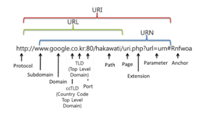
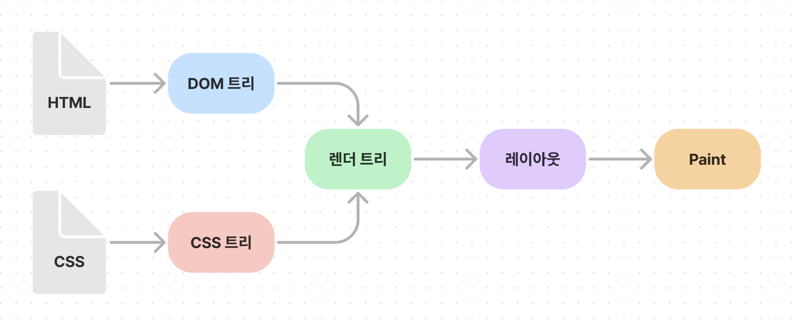
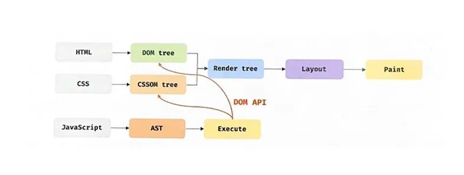

# chapter 38 : 브라우저의 렌더링 과정
Node.js의 등장으로 조금 더 쉽게 app 개발에 사용할 수 있게 되었다.  
자바스크립트는 브라우저에서 HTML, CSS와 함께 실행된다.

브라우저의 렌더링과정은 다음과 같다.
- HTML, CSS, JS, 이미지 ,폰트 파일 등 렌더링에 필요한 리소스를 요청하고 서버로부터 응답을 받는다.
- HTML, CSS를 파싱하여 DOM, CSSOM을 생성하고 이를 이용해 렌더 트리를 생성한다.
- 브라우저의 렌더링 엔진은 서버로부터 응답된 자바스크립트를 파싱하여 AST(Abstract Syntax Tree)를 생성하고 바이트코드로 변환하여 실행한다. 이 때 DOM API를 통해 JS는 DOM, CSSOM 변경 가능
- HTML  요소의 레이아웃을 계산하고 브라우저 화면에 HTML 요소를 페인팅한다.  

request -> html, css로 dom, cssom만들고 이를 통해 렌더 트리 구성 -> JS 파싱으로 AST생성, dom, cssom 변경 -> 렌더 트리 기반 레이아웃 계산 및 페인팅

### 요청과 응답
필요한 리소스는 모두 서버에 있으므로 서버에 리소스 요청 및 응답 리소스를 파싱하여 렌더링  
  
uri, urn, url

일반적으로 서버는 루트 요청에 대해 암묵적으로 index.html을 응답   
브라우저의 렌더링 엔진이 html 파싱 도중 외부 리소스 로드 태그(css, img, script 등)을 만나면 html 파싱을 일시 중단하고 해당 리소스 파일을 요청해서 받아옴

### HTTP 1.1과 HTTP 2.0
HTTP(HyperText Transer Protocol)은 웹에서 브라우저와 서버가 통신하기 위한 프로토콜(규약)이다.  
1996년 HTTP/1.0, 1999년 HTTP/1.1, 2015년 HTTP/2가 발표됨.  
**HTTP 1.1**은 커넥션당 하나의 요청과 응답만 처리 -> 리소스 동시 전송 불가능으로 요청할 리소스의 개수이 비례하여 응답 시간도 증가  
**HTTP 2.0**은 커넥션당 여러 개의 요청과 응답, 즉 다중 요청/응답이 가능. -> 1.1에 비해 속도가 약 50% 빠르다고 알려져 있음.

### HTML 파싱과 DOM 생성
1. HTML 파일이 브라우저 요청에 의해 응답. 서버는 HTML 파일 읽어 들여 메모리 저장 후 바이트(2진수)로 인터넷을 경유하여 응답
2. 브라우저는 바이트 형태로 응답받고, meta 태그의 charset 어트리뷰트에 의해 지정된 인코딩 방식으로 문자열 변환 ( charset은 응답 헤더에 담겨 응답됨)
3. 문자열 변환된 HTML 문서를 코드 최소 단위인 토큰들로 분해
4. 토큰들을 객체로 변환하여 노드 생성. 
5. HTML문서는 HTML 요소들의 집합으로 이루어지며 HTML 요소는 중첩 관계를 가짐. 이런 관계를 반영하여 모든 노드들을 트리 자료구조로 구성. 이 트리 자료구조를 **DOM(Document Object Model)**이라 부름.

-> DOM은 HTML 문서 파싱 결과물

### CSSS 파싱과 CSSOM 생성
HTML과 동일한 과정을 거침. CSS는 CSSOM을 생성. HTML 태그 속 CSS를 만나면 이때 로드

### 렌더 트리 생성
HTML의 DOM과 CSS의 CSSOM을 합쳐 렌더 트리로 결합  
렌더트리는 렌더링을 위한 트리 구조의 자료구이기 때문에 브라우저 화면에 렌더링되지 않는 노드(meta 태그, script 태그 등)과 CSS에 의해 비표시(display:none 등)은 포함 x  
  
다음과 같은 상황에 레이아웃 및 페인팅 재차 실행  
- JS에 의한 노드 추가, 삭제
- 브라우저 창의 리사이징에 의한 뷰포트 크기 변경
- HTML 요소 레이아웃 변경 발생시키는 width/height, margin, padding, border, display, position, top/right/bottom/left등의 스타일 변경  

**비용이 많이 드므로 주의!**
### 자바스크립트 파싱과 실행
HTML진행하다가 script태그 만날 시 렌더링 엔진은 js 엔진에 제어권을 넘김.  
js 엔진은 js 코드를 파싱하여 cpu가 이해할 수 있는 저수준 언어로 변환하고 실행  
구글 크롬과 Node.js의 V8, 파이어폭스의 SpiderMonkey, 사파리의 JavaScriptCore 등 다양한 종류 있음   
-> 모두 ECMAScript 사양 준수  
  

js코드에 의해 dom, cssom 변경 시 리플로우, 리페인트 실행  
리플로우와 리페인트가 반드시 순차적으로 동시에 실행되는 것은 아님. 레이아웃에 영향이 없는 변경은 리페인트만 실행

### 자바스크립트 파싱에 의한 HTML 파싱 중단
동기적으로 진행되기 때문에 script 위치는 중요하다. DOM 생성 전에 DOM API로 변경하려 할 경우 문제가 발생할 수 있다.  
따라서 script태그를 가장 아래에 위치시키는 것은 좋은 전략이다.

### script 태그의 async/defer 어트리뷰트
async, defer 어트리뷰트는 src 어트리뷰트를 통해 외부 자바스크립트 파일을 로드하는 경우에만 사용가능  
IE10이상에서 지원. (defer는 IE6~9도 지원하지만 정상 동작 안될 수 있음)
#### async 어트리뷰트  
HTML 파싱과 외부 JS 파일의 로드가 비동기적으로 진행 된다.  
JS 파싱과 실행은 자바스크립트 파일의 로드가 완료된 직후 진행되며, 이때 HTML 파싱은 중단된다.   
즉 순서 보장이 필요한 script 태그에는 async 어트리뷰트 지정하면 안된다.
#### defer 어트리뷰트
async와 비슷하지만 js 파싱과 실행은 HTML 파싱 완료 직후, 진행한다. 

## Question
* parsing은 무엇인가요?
* 브라우저 렌더링 과정에 대해 설명해주세요.
* script태그에서의 async와 defer의 차이를 말해주세요.
