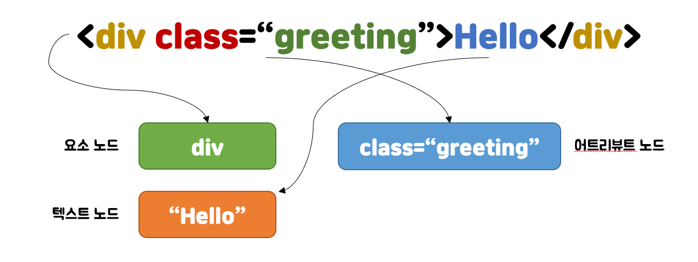
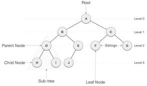
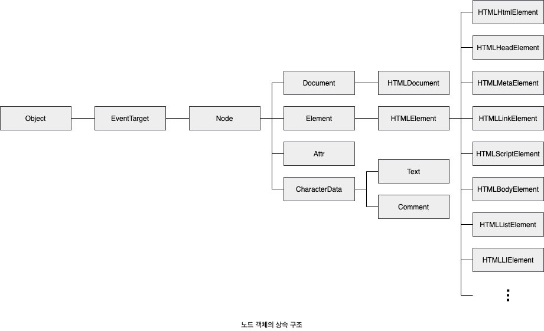

# Chapter39 : DOM
DOM(Documnent Object Model)은 HTML 문서의 계층적 구조와 정보를 표현하며 이를 제어할 수 있는 API, 즉 프로퍼티와 메서드를 제공하는 트리 자료구조다.
## 노드
### HTML 요소와 노드 객체
HTML 요소는 HTML 문서를 구상하는 개별적인 요소를 의미한다.
```js
<div class="greeting">Hello</div>
```
- div : 시작태그
- class : 어트리뷰트 이름
- "greeting": 어트리뷰트 값
- Hello : 콘텐츠
- /div : 종료태그  

이는 다음과 같이 된다.

### 트리 자료구조
트리 자료구조는 노드들의 계층 구조로 이루어진다. 즉 부모 노드와 자식 노드로 구성되어 계층적 구조를 표현하는 비선형 자료구조이다.  
**비선형자료구조** : 하나의 자료 뒤에 여러 개의 자료가 존재할 수 있는 자료구조(트리, 그래프 등)  
트리 자료구조는 하나의 최상위 노드에서 시작. 최상위 노드는 부모 노드 x (루트 노드), 자식 노드가 없는 노드는 리프 노드라고 한다.  
  
노드 객체들로 구성된 트리 자료구조를 DOM이라 한다. 트리이기 때문에 DOM 트리라고 하기도 한다.
  
DOM은 위와 같으며 노드 객체는 총 12개의 종류가 있다. 그 중 중요한 것은 4가지 이다.

#### 문서 노드
DOM 트리 최상위의 루트 노드로 document객체를 가리킨다. window.cdocument, document로 참조할 수 있다.
#### 요소 노드
HTML 요소를 가리키는 객체. 
#### 어트리뷰트 노드
HTML 요소의 어트리뷰트를 가리키는 객체. 어트리뷰트 노드는 어트리뷰트가 지정된 HTML 요소의 요소 노드와 연결되어있다.   
요소 노드는 부모 노드와 연결되어있지만 어트리뷰트 노드는 요소 노드와만 연결되어 있다. 즉, 요소 노드의 형제 노드는 아니다.
#### 텍스트 노드
HTML 요소의 텍스트를 가리키는 객체. 자식 노드를 가질 수 없는 리프 노드이며 DOM 트리의 최종단.  
#### 그 외 노드
Comment, DOCTYPE을 위한 DocumentType, 복수 노드 생성 추가 때의 DocumentFragment 등...

### 노드 객체의 상속 구조
DOM을 구성하는 노드 객체는 ECMAScript 사양에 정의된 표준 빌트인 객체가 아니라 브라우저 환경에서 추가적으로 제공하는 호스트 객체이다. 노드 객체도 자바스크립트 객체이므로 프로토타입에 의한 상속 구조를 갖는다.
  
노드 객체의 상속 구조는 개발자 도구의 Elements 패널 우측의 Properties 패널에서 확인 가능하다.

## 요소 노드 취득
### id를 이요한 요소 노드 취득
Document.prototype.getElementById 메서드는 인수로 전달한 id 어트리뷰트 값을 이용해 요소 노드를 찾는다.  
Document.prototype의 프로퍼티로 getElementById있기에 반드시 문서 노드인 document를 통해 호출해야 한다.  
id 값에 해당하는 HTML 요소가 없을 경우 getElementById는 null을 반환한다.  
id 어트리뷰트 부여시 id 값과 동일한 이름의 전역 변수가 암묵적으로 선언되고 해당 노드 객체가 할당되는 부수 효과가 있다.
