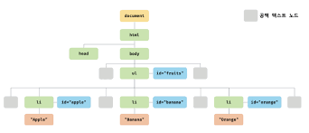
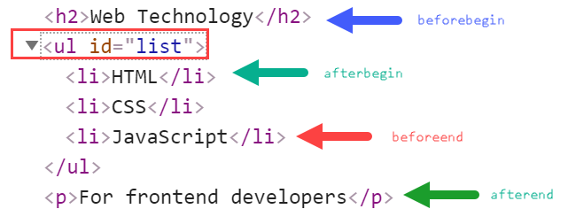

# Chapter39 : DOM
DOM(Documnent Object Model)은 HTML 문서의 계층적 구조와 정보를 표현하며 이를 제어할 수 있는 API, 즉 프로퍼티와 메서드를 제공하는 트리 자료구조다.
## 노드
### HTML 요소와 노드 객체
HTML 요소는 HTML 문서를 구상하는 개별적인 요소를 의미한다.
```js
<div class="greeting">Hello</div>
```
- div : 시작태그
- class : 어트리뷰트 이름
- "greeting": 어트리뷰트 값
- Hello : 콘텐츠
- /div : 종료태그  

이는 다음과 같이 된다.

### 트리 자료구조
트리 자료구조는 노드들의 계층 구조로 이루어진다. 즉 부모 노드와 자식 노드로 구성되어 계층적 구조를 표현하는 비선형 자료구조이다.  
**비선형자료구조** : 하나의 자료 뒤에 여러 개의 자료가 존재할 수 있는 자료구조(트리, 그래프 등)  
트리 자료구조는 하나의 최상위 노드에서 시작. 최상위 노드는 부모 노드 x (루트 노드), 자식 노드가 없는 노드는 리프 노드라고 한다.  
  
노드 객체들로 구성된 트리 자료구조를 DOM이라 한다. 트리이기 때문에 DOM 트리라고 하기도 한다.
  
DOM은 위와 같으며 노드 객체는 총 12개의 종류가 있다. 그 중 중요한 것은 4가지 이다.

#### 문서 노드
DOM 트리 최상위의 루트 노드로 document객체를 가리킨다. window.document, document로 참조할 수 있다.
#### 요소 노드
HTML 요소를 가리키는 객체. 
#### 어트리뷰트 노드
HTML 요소의 어트리뷰트를 가리키는 객체. 어트리뷰트 노드는 어트리뷰트가 지정된 HTML 요소의 요소 노드와 연결되어있다.   
요소 노드는 부모 노드와 연결되어있지만 어트리뷰트 노드는 요소 노드와만 연결되어 있다. 즉, 요소 노드의 형제 노드는 아니다.
#### 텍스트 노드
HTML 요소의 텍스트를 가리키는 객체. 자식 노드를 가질 수 없는 리프 노드이며 DOM 트리의 최종단.  
#### 그 외 노드
Comment, DOCTYPE을 위한 DocumentType, 복수 노드 생성 추가 때의 DocumentFragment 등...

### 노드 객체의 상속 구조
DOM을 구성하는 노드 객체는 ECMAScript 사양에 정의된 표준 빌트인 객체가 아니라 브라우저 환경에서 추가적으로 제공하는 호스트 객체이다. 노드 객체도 자바스크립트 객체이므로 프로토타입에 의한 상속 구조를 갖는다.
  
노드 객체의 상속 구조는 개발자 도구의 Elements 패널 우측의 Properties 패널에서 확인 가능하다.

## 요소 노드 취득
### id를 이용한 요소 노드 취득
Document.prototype.getElementById 메서드는 인수로 전달한 id 어트리뷰트 값을 이용해 요소 노드를 찾는다.  
Document.prototype의 프로퍼티로 getElementById있기에 반드시 문서 노드인 document를 통해 호출해야 한다.  
id 값에 해당하는 HTML 요소가 없을 경우 getElementById는 null을 반환한다.  
id 어트리뷰트 부여시 id 값과 동일한 이름의 전역 변수가 암묵적으로 선언되고 해당 노드 객체가 할당되는 부수 효과가 있다.  
이미 있을 경우 할당 x

### 태그 이름을 이용한 요소 노드 취득
Document.prototype/Element.prototype.getElementsByTagName 메서드는 인수로 전달한 태그 이름을 갖는 모든 요소 노드 탐색하여 반환. HTMLCollection 객체를 반환함.  
- Document.prototype.getElementsByTagName : 문서 노드(DOM 전체)에서 요소 노드 찾아 반환
- Element.prototype.getElementsByTagName : 특정 요소 노드의 자손 노드 중에서 요소 노드 탐색하여 반환

해당 값 없을경우 빈 HTMLCollection 객체 반환

### class를 이용한 요소 노드 취득
Document.prototype/Element.prototype.getElementsByClassName은 class 값으로 모든 요소 노드들을 탐색하여 반환.
다른 모든 것은 태그 이름을 이용한 요소 노드 취득과 같다.

### CSS 선택자를 이용한 요소 노드 취득
Document.prototype/Element.prototype.querySelector 메서드는 인수로 전달한 CSS 선택자를 만족시키는 하나의 요소 노드를 탐색하여 반환한다.
- 인수로 전달한 CSS 선택자를 만족시키는 요소 노드가 여러 개인 경우 첫 번째 요소 노드만 반환한다.
- 인수로 전달된 CSS 선택자를 만족시키는 요소 노드가 존재하지 않는 경우 null을 반환한다.
- 인수로 전달한 CSS 선택자가 문법에 맞지 않는 경우 DOMException 에러가 발생한다.

Document.prototype/Element.prototype.querySelectorAll은 위의 경우에서 모두 찾아 DOM 컬렉션 객체인 NodeList를 반환한다.
- 인수로 전달된 CSS 선택자를 만족시키는 요소가 존재하지 않는 경우 빈 NodeList 객체를 반환
- 인수로 전달한 CSS 선택자가 문법에 맞지 않는 경우 DOMException 에러 발생

Document, Element의 차이는 위의 경우와 같음

### 특정 요소 노드 취득 가능여부 확인
Element.prototype.matches 는 인수로 전달한 CSS 선택자를 통해 특정 요소 노드 취득 여부를 확인  
메서드 위임에 유용

### HTMLCollection과 NodeList
둘다 유사 배열 객체이면서 이터러블, 따라서 for ...of문 순회 가능 + 스프레드 문법 사용으로 배열 변환 가능  
HTMLCollection은 항상 live 객체, NodeList는 경우에 따라 live 객체

#### HTMLCollection
이터러블 + 살아있는 객체이기 때문에 for문으로 상태 변경시 주의해야함. 몇몇 문제는 for 문 역방향 순회로 회피 가능  
쉬운 회피 방법은 HTMLCollection 객체를 사용하지 않는 것. 배열로 변환하여 사용하는 것 추천.
#### NodeList
보통은 non-live이지만, childNodes 프로퍼티가 반환하는 NodeList 객체는 HTMLCollection 객체처럼 live 객체로 동작하므로 주의 필요  
따라서 배열 변환 사용 추천

## 노드 탐색
요소 노드 취득 후 부모, 형제, 자식 노드 등을 탐색해야 할 때 사용 가능.  
노드 탐색 프로퍼티는 모두 접근자 프로퍼티로 setter없이 getter만 있는 참조만 가능한 읽기 전용 접근자 프로퍼티이다.
### 공백 텍스트 노드
HTML 문서의 공백 문자는 공백 텍스트 노드를 생성한다. 하지만 억지로 지우면 가독성이 좋지 않으므로 권장 X

### 자식 노드 탐색
- Node.prototype.childNodes : 자식 노드 모두 탐색후 NodeList에 담아 반환, 텍스트 노드도 포함 가능
- Element.prototype.children : 자시 곤드 중에서 요소 노드만 모두 탐색하여 HTMLCollection에 담아 반환, 텍스트 노드 포함 x
- Node.prototype.firstChild : 첫번째 자식 노드 반환, 텍스트 노드 or 요소 노드
- Node.prototype.lastChild : 마지막 자식 노드 반환, 텍스트 노드 or 요소 노드
- Element.prototype.firstElementChild : 첫번째 자식 요소 노드 반환, 요소 노드만 반환
- Element.prototype.lastElementChild : 첫번째 자식 요소 노드 반환, 요소 노드만 반환
### 자식 노드 존재 확인
Node.prototype.hasChildNodes 메서드로 true false 확인 가능

### 부모 노드 탐색
Node.prototype.parentNode 프로퍼티 사용으로 부모 노드 탐색 가능(텍스트 노드는 리프 노드이므로 여기서 나오지 않음)

### 형제 노드 탐색
어트리뷰트 노드는 요소 노드와 연결되어 있지만 부모 노드가 같은 형제 노드가 아니므로 반환 x.     
즉 아래 프로퍼티는 텍스트 노드 or 요소 노드만 반환  
- Node.prototype.previousSibling : 이전 형제 노드  
- Node.prototype.nextSibling : 다음 형제 노드  
- Element.prototype.previosElementSibling : 이전 형제 노드 (요소 노드 확정)  
- Element.prototype.nextElementSibling : 다음 형제 노드 (요소 노드 확정)  

### 노드 정보 취득
- Node.protytype.nodeType : 노드 타입 상수는 Node에 정의되어 있음
    - 요소 노드: 1  
    - 텍스트 노드 : 3
    -  문서 노드 : 9
- Node.protytype.nodeType : 노드 이름 문자열 반환
     - 요소 노드: 대문자 문자열로 태그 반환
     - 텍스트 노드: 문자열 "#text"반환
     - 문서 노드: 문자열 "#document"를 반환

## 요소 노드의 텍스트 조작
### nodeValue
Node.prototype.nodeValue는 setter와 getter가 모두 존재하는 접근자 프로퍼티로 참조 할당 모두 가능  
노드 객체의 값은 텍스트 노드의 텍스트.  다른 노드 참조시 null 반환
### textContent
요소 노드의 콘텐츠 영역 내의 텍스트를 모두 반환. HTML 마크업은 무시  
값 할당 시 모든 자식 노드 제거 및 할당한 문자열이 텍스트 추가(HTML 마크업 파싱 X)  
innerText로 비슷하지만 쓰지 않는 것이 좋은 이유는 다음과 같다.
1. css에 순종적으로 (visibility: hidden)같은 것은 반환하지 않는다.
2. css 고려도 하기에 textContent 보다 더 느리다.
## DOM 조작
리플로우, 리페인트 발생 원인이 되고, 이는 성능에 악영향을 주므로 주의해서 다뤄야 한다.
### innerHTML
Element.prototype.innerHTML 은 setter와 getter 모두 존재하는 프로퍼티  
innerHTML은 textContent와 다르게 HTML 마크업을 문자열로 반환  
값 할당시 모든 자식 노드 제거 및 할당한 문자열이 텍스트 추가(HTML 마크업 파싱 O)   
사용자 입력값 그대로 할당시 크로스 사이트 스크립팅 공격에 취약하므로 위험.  
- 간단한 요소 새롭게 추가할 때 유용
- 새로운 요소 삽입 위치 지정 불가
- HTML 마크업 무자열 할당 시 효율적이지 않음
#### HTML 새니티제이션
크로스 사이트 스크립팅 공격을 예방하기 위해 잠재적 위험 제거하는 기능  
DOMPurify 라이브러리 사용 권장
### insertAdjacentHTML 메서드
Element.prototype.insertAdjacentHTML(position, DOMString) 메서드는 기존 요소 제거하지 않으면서 위치를 지정해 새로운 요소 삽입  
  
insertHTML 보다 효율적이지만 똑같이 크로스 사이트 스크립팅 공격에 취약
### 노드 생성과 추가
#### 요소 노드 생성
Document.prototype.createElement(tagName) 메서드는 요소 노드 생성하여 반환.  
만들었지만 기존 DOM에 추가 되지는 않았으므로, DOM 추가하는 별도 처리 필요  
자식 노드 및 텍스트 노드도 없는 상태
#### 텍스트 노드 생성
Document.prototype.createTextNode(text)는 텍스트 노드 생성 및 반환  
이 역시 DOM에 넣는 별도 처리 필요
#### 텍스트 노드를 요소 노드의 자식 노드로 추가
Node.prototype.appendChild(childNode)는 childNode에게 인수로 전달한 노드를 호출한 노드의 마지막 자식 노드로 추가  
자식 노드가 하나도 없을 경우는 textContext 가 훨씬 간편  
#### 요소 노드를 DOM에 추가
Node.prototype.appendChild로 텍스트 노드와 부자 관계로 연결한 요소 노드를 요소 노드의 마지막 자식 요소로 추가  
이 때 리플로우와 리페인트 실행
### 복수 노드 생성 & 추가
같은 작업을 3번 할 경우 리플로우, 리페인트가 3번 일어나므로 비효율적이다.   
이럴 경우 container를 만들고 내부 요소를 만든 뒤 DOM에 넣어주면 보다 효율적으로 진행 가능하지만 불필요한 컨테이너(div)가 생성되므로 좋지 않다.  
DocumentFragment 노드로 해결 가능
### 노드 삽입
#### 마지막 노드로 추가
Node.prototype.appendChild: 마지막 자식 노드로 DOM에 추가(항상 마지막에)
#### 지정한 위치에 노드 삽입
Node.prototype.insertBefore(newNode, childNode) :  두번째 인수로 전달받은 노드 앞에 첫번째 인수로 전달받은 노드 삽입  
childNode는 Node의 자식 노드여야만 함. 그렇지 않으면 DOMException 에러 발생
### 노드 이동
DOM에 이미 존재하는 노드를 appendChild, insertBefore를 이용하면 노드가 이동함
### 노드 복사
Node.prototype.cloneNode([deep: true | false]) : 노드의 사본을 생성하여 반환  
deep은 깊은복사냐 아니냐를 결정    
- true: 깊은 복사로 모든 자손 노드가 포함된 사본 생성  
- false 혹은 생략 : 얕은 복사로 노드 자신만의 사본 생성(자손 노드 복사 x, 텍스트 노드 x) 
- 얕은 복사시 태그 + 어트리뷰트 복사 

ex)
```html
<ul id="myList">
  <li>Item 1</li>
  <li>Item 2</li>
</ul>
```
```js
const originalList = document.getElementById("myList");
const clonedList = originalList.cloneNode(false);

console.log(originalList.outerHTML); 
// <ul id="myList">
//  <li>Item 1</li>
//  <li>Item 2</li>
// </ul>
console.log(clonedList.outerHTML); // <ul id="myList"></ul>
```
### 노드 교체
Node.prototype.replaceChild(newChild, oldChild): oldChild를 newChild로 교체  (oldChild는 DOM에서 제거)  
oldChild는 Node의 자식이어야함.  
### 노드 삭제
Node.prototype.removeChild(child): child 매개변수에 인수로 전달한 노드를 DOM에서 삭제  
child는 Node의 자식이어야함.
## 어트리뷰트
### 어트리뷰트 노드와 attributes 프로퍼티
- 글로벌 어트리뷰트는 모든 HTML 요소에서 사용 가능.  
- type, value, checked 어트리뷰트는 input 요소에서만 사용 가능  
- HTML 어트리뷰트는 HTML 문서 파싱시 하나의 어트리뷰트당 하나의 어트리뷰트 노드로 변환되어 요소 노드와 연결
- 유사배열이자 이터러블인 NamedNodeMap 객체에 담겨 요소 노드의 attributes 프로퍼티에 저장
- Element.prototype.attributes 프로퍼티로 취득 가능(getter만 존재)
### 어트리뷰트 조작
위의 것은 attributes 프로퍼티를 통해서만 HTML 어트리뷰트 값을 취득할 수 있으며, 변경은 불가능해서 불편  
**Element.prototype.getAttribute/setAttribute**: attributes 프로퍼티를 통하지 않고 직접 HTML 어트리뷰트 값 취득 및 변경 가능해서 편리  
**Element.prototype.hasAttribute(attributeName)**: 특정 HTML 어트리뷰트 존재 확인 가능
**Element.prototype.removeAttribute(attributeName)** : 특정 HTML 어트리뷰트 삭제 
### HTML 어트리뷰트 vs DOM 프로퍼티
HTML 어트리뷰트는 다음과 같이 DOM에서 중복 관리되는 것처럼 보인다.
- 요소 노드의 attributes 프로퍼티에서 관리하는 어트리뷰트 노드
- HTML 어트리뷰트에 대응하는 요소 노드의 프로퍼티(DOM 프로퍼티)
#### 하지만 중복 관리되는 것이 아니다. 요소 노드는 초기 상태와 최신 상태 2가지를 가지고 있기 때문이다.
HTML어트리뷰트 : HTML 요소의 초기 상태 지정, HTML 어트리뷰트 값은 곧 HTML 요소의 초기 상태를 의미하며 변하지 않음  
DOM 프로퍼티 : 요소의 최신 상태 관리에 사용  
#### HTML 어트리뷰트와 DOM 프로퍼티의 대응 관계
둘은 거의 1:1 대응하지만 몇몇은 다르다. (왼쪽이 어트리뷰트, 오른쪽이 프로퍼티 관련)
- id: 1:1, 동일한 값 연동
- input의 value : 1:1 대응, 어트리뷰트는 초기 상태, 프로퍼티는 최신 상태
- class: className, classList와 대응
- for : htmlFor와 대응
- td 요소의 colspan : 프로퍼티 존재 x
- x : textContent ( textContent 프로퍼티에 대응되는 어트리뷰트는 없음)
- 어트리뷰트 이름은 대소문자 구별 x  -> 대응 프로퍼티 키는 카멜 케이스
#### DOM 프로퍼티 값의 타임
getAttribute 값은 항상 문자열.  
하지만 DOM 프로퍼티는 문자열이 아닐 수 있음.
### data 어트리뷰트와 dataset 프로퍼티
- data 어트리뷰트와 dataset 프로퍼티로 js와 데이터 교환가능  
- data-user-id, data-role과 같이 data- 접두사 다음에 임의의 이름을 붙여 사용  
- HTMLElement.dataset 프로퍼티로 취득  
- dataset 프로퍼티는 data어트리뷰트의 dta-접두사 다음에 붙인 임의의 이름을 카멜 케이스로 변환한 프로퍼티를 가지는 DOMStringMap객체 반환   
- dataset 프로퍼티에 값을 할당하면 HTML 요소에 data 어트리뷰트 추가(data- 접두사 다음에 케밥케이스로 자동 변경되어 추가)
## 스타일
### 온라인 스타일 조작
HTMLElement.prototype.style: setter와 getter 모두 존재하는 접근자 프로퍼티, 요소 노드의 인라인 스타일 취득하거나 추가, 변경  
참조시 CSSStyleDeclaration 타입 객체 반환  
CSS 프로퍼티는 케밥 케이스 따름
### 클래스 조작
.으로 시작하는 클래스 선택자를 이용할 수 있음
class 어트리뷰트에 대응하는 DOM 프로퍼티는 className과 classList. (class는 js 예약어이기 때문)
#### className
- Element.prototype.className: setter와 getter 모두 존재하는 접근자 프로퍼티  
- 참조시 class 어트리뷰트 값을 문자열로 반환  
- className 프로퍼티에 문자열 할당시 class 어트리뷰트 값을 할당한 문자열로 변경  
- 공백으로 구분된 여러 개의 클래스를 반환하는 경우 다루기 불편
#### classList
- Element.prototype.classList : class 어트리뷰트의 정보를 담은 유사 배열 객체이자 이터러블인 DOMTokenList 객체를 반환
    - add(...classsName) : 인수로 전달한 1개 이상의 문자열을 class 어트리뷰트 값으로 추가
    - remove(... className) : 인수로 전달한 1개 이상의 문자열과 일치하는 클래스를 class 어트리뷰트에서 삭제
    - item(index) : 인수로 전달한 index에 해당하는 클래스를 class 어트리뷰트에서 반환
    - contains(className) : 있는지 true, false 확인
    - replace(oldClassName, newClassName): 클래스 변경
    - toggle(className[, force]): 클래스 존재 시 제거, 없으면 추가, 두번째 인수로 불리언 값 줄시 true면 강제로 추가, false면 강제로 삭제
    - forEach, entries, keys, values, supports 등 제공 
### 요소 적용 CSS 스타일 참조    
style 프로퍼티는 인라인 스타일만 반환(클래스 적용 스타일, 상속 적용 스타일은 참조 불가)  
필요할 때는 getComutedStyle로 가져올 수 있음
window.getComputedStyle(element[, pseudo]): element 스타일을 CSSStyleDeclaration 객체에 담아 반환  
두번째 요소인 pseudo는 :after, :before와 같은 의사 요소를 지정하는 문자열 (필요 없으면 생략)  
## DOM 표준
HTML과 DOM 표준은 W3C(World Wide Web Consortium)과 WHATWG(Web Hypertext Application Technology Working Group)이라는 두 단체가 나름대로 협력하며 공통 표준을 만듬  
두 단체가 서로 다른 결과물을 내놓기 시작했고 2018년 4월부터 WHATWG이 단일 표준을 내놓기로 두 단체가 합의했다.  
현재 DOM은 4개의 레벨(버전)이 있다. DOM Level 1 ~ DOM Level 4
## Question
- 요소 노드를 취득하는 여러 방법을 말하고 그 차이를 설명하세요.
- Node.prototype.textContent와 Node.prototype.innerText의 차이를 설명하세요.
- 바닐라JS로 복수 노드를 생성 후 추가한다고 할 때 어떻게 하는게 좋을지 설명해주세요.
