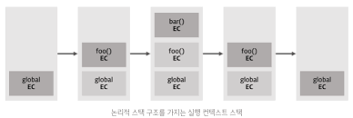
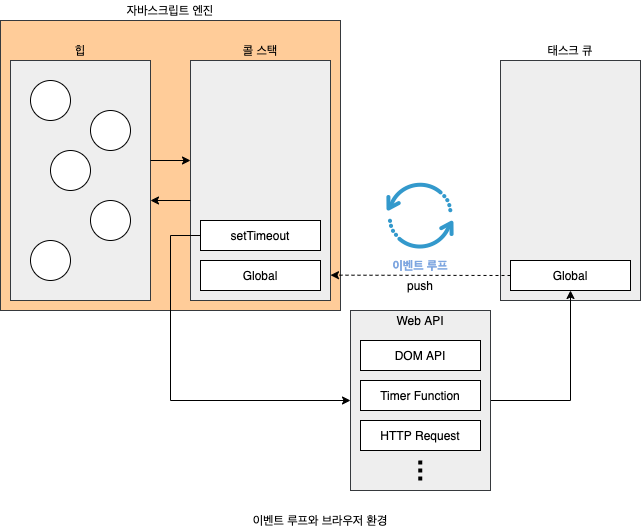

# chapter42 : 비동기 프로그래밍

## 동기 처리와 비동기 처리 
23장 실행 컨텍스트에서 살펴본 바와 같이 함수를 호출하면 함수 코드가 평가되어 함수 실행 컨텍스트가 생성된다.  
이 때 생성된 함수 실행 컨텍스트는 실행 컨텍스트 스택(콜 스택이라고도 부름)에 푸시되고 함수코드가 실행.  
함수 실행 종료시 함수 실행 컨텍스트는 실행 컨텍스트 스택에서 팝되어 제거된다. 
```js
ex)
const foo = () => {};
const bar = () => {};

foo();
bar();

```
  
이처럼 함수 실행 순서는 실행 컨텍스트 스택으로 관리한다.  
**자바스크립트 엔진은 단 하나의 실행 컨텍스트 스택을 갖는다** 
실행 중인 실행 컨텍스트를 제외한 모든 실행 컨텍스트는 모두 실행 대기 중인 태스크들이다.  
이처럼 js 엔진은 한 번에 하나의 태스크만 실행할 수 있는 싱글 스레드 방식으로 동작한다. 따라서 처리에 시간이 걸리는 태스크를 실행하는 경우 블로킹(작업 중단)이 발생한다.  
현재 실행 중인 태스크가 종료 되지 않은 상태라 해도 다음 태스크를 곧바로 실행하는 방식을 **비동기(asynchronous) 처리**라고 한다.  
비동기 처리를 수행하는 비동기 함수는 전통적으로 콜백 패턴을 사용한다. 
**타이머 함수인 setTimeout과 setInterval, HTTP 요청, 이벤트 핸들러는 비동기 처리 방식으로 동작한다**

## 이벤트 루프와 태스크 큐
자바스크립트의 동시성을 지원하는 것이 바로 이벤트 루프이다.  
이벤트 루프는 브라우저에 내장되어 있는 기능 중 하나다.
  
구글의 V8 자바스크립트 엔진을 비롯한 대부분의 JS 엔진은 크게 2개의 영역으로 구분할 수 있다.
- 콜 스택(call stack)
실행 컨텍스트에서 살펴본 바와 같이 소스코드 평가 과정에서 생성된 실행 컨텍스트가 추가되고 제거되는 스택 자료구조인 실행 컨텍스트 스택이 바로 콜 스택이다. 함수를 호출하면 함수 실행 컨텍스트가 순차적으로 콜 스택에 푸시되어 순차적으로 실행된다. js는 단 하나의 콜 스택을 사용하기 때문에 실행 컨텍스트가 종료되어 콜 스택에서 제거되기 전까지 다른 어떤 태스크도 실행되지 않는다.
- 힙(heap)
힙은 객체가 저장되는 메모리 공간이다. 콜 스택의 요소인 실행 컨텍스트는 힙에 저장된 객체를 참조한다.  
메모리에 값을 저장하려면 먼저 값을 저장할 메모리 공간의 크기를 결정해야 한다. 객체는 원시 값과는 달리 크기가 정해져 있지 않으므로 할당해야 할 메모리 공간의 크기를 런타임에 결정(동적 할당)해야 한다. 따라서 객체가 저장되는 메모리 공간인 힙은 구조화되어 있지 않다는 특징이 있다.

**비동기 처리에서 소스코드의 평가와 실행을 제외한 모든 처리는 자바스크립트 엔진을 구동하는 환경인 브라우저 또는 Node.js가 담당한다.** 
브라우저 환경은 태스크 큐와 이벤트 루프를 제공한다.
- 태스크 큐(task queue/event queue/callback queue)  
setTimout이나 setInterval과 같은 비동기 함수의 콜백 함수 또는 이벤트 핸들러가 일시적으로 보관되는 영역이다. 
- 이벤트 루프  
콜 스택에 현재 실행 중인 실행 컨텍스트가 있는지, 그리고 태스크 큐에 대기 중인 함수(콜백 함수, 이벤트 핸들러 등)가 있는지 반복해서 확인. 만약 콜 스택이 비어 잇고 태스크 큐에 대기 중인 함수가 있다면 이벤트 루프는 순차적으로(FIFO) 태스크 큐에 대기 중인 함수를 콜 스택으로 이동시킨다.

**자바 스크립트는 싱글 스레드 방식으로 동작. 허나 브라우저가 아닌 브라우저에 내장된 JS 엔진이 그러한 것이다.** 만약 모든 js 코드가 js 엔진에서 싱글 스레드 방식으로 동작한다면 js는 비동기로 동작할 수 없다. 즉 js 엔진은 싱글 스레드로 동작하지만 브라우저는 멀티 스레드로 동작한다.
