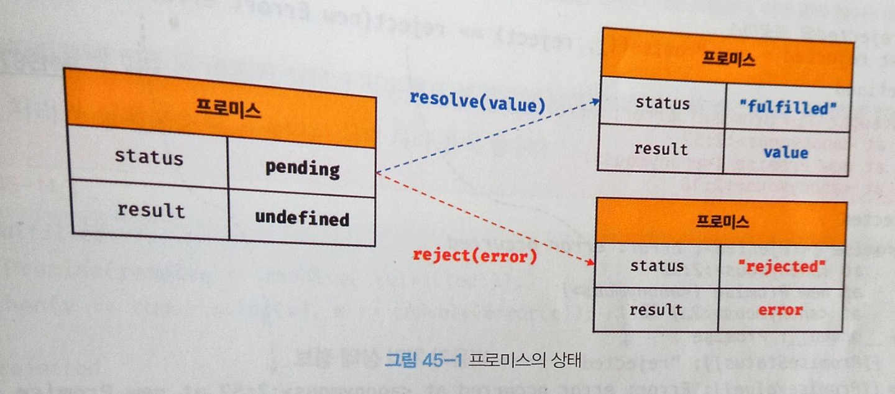

# chapter45 : 프로미스
js는 콜백 함수를 사용해 비동기 처리를 하지만, 가독성이 나쁘고 에러 처리가 곤란하기에 ES6에서는 비동기 처리를 위한 또 다른 패턴으로 프로미스를 도입했다.

## 비동기 처리를 위한 콜백 패턴의 단점
### 콜백 헬
```js
// GET 요청을 위한 비동기 함수
const get = url => {
    const xhr = new XMLHttpRequest();
    xhr.open('GET', url);
    xhr.send();

    xhr.onload = () => {
        if (xhr.status === 200) {
            console.log(JSON.parse(xhr.response));
        } else {
            console.error(`${xhr.status} ${xhr.statusText}`);
        }
    };
};
// id가 1인 post를 취득
get('https://jsonplacehoder.typicode.com/posts/1');
```
**get 함수는 비동기 함수로 비동기 함수를 호출 시 함수 내부의 비동기로 동작하는 코드가 완료되지 않았다 해도 기다리지 않고 즉시 종료된다. 따라서 비동기 함수 내부의 비동기로 동작하는 코드에서 처리 결과를 외부로 반환하거나 상위 스코프의 변수에 할당하면 기대한 대로 동작하지 않는다.**  
get 함수가 비동기 함수인 이유는 get 함수 내부의 onload 이벤트 핸들러가 비동기로 동작하기 때문이다. 
- **서버로부터 응답이 도착하면 xhr 객체에서 load 이벤트가 발생한다. 이 때 xhr.onload 핸들러 프로퍼티에 바인딩한 이벤트 핸들러가 즉시 실행되는 것이 아니다. xhr.onload 이벤트 핸들러는 load 이벤트가 발생하면 일단 태스크 큐에 저장되어 대기하닥, 콜 스택이 비면 이벤트 루프에 의해 콜 스택으로 푸시되어 실행된다.**
- **이처럼 비동기 함수는 비동기 처리 결과를 외부에 반환할 수 없고, 상위 스코프의 변수에 할당할 수도 없다. 따라서 비동기 함수의 처리 결과(서버의 응답 등)에 대한 후속 처리는 비동기 함수 내부에서 수행해야 한다. 이때 비동기 함수를 범용적으로 사용하기 위해 비동기 함수에 비동기 처리 결과에 대한 후속 처리를 수행하는 콜백 함수를 전달하는 것이 일반적이다. 필요에 따라 비동기 처리가 성공하면 호출될 콜백 함수와 비동기 처리가 실패하면 호출될 콜백 함수를 전달할 수 있다.**
- 비동기 함수가 비동기 처리 결과를 가지고 또다시 비동기 함수를 호출해야 한다면 콜백 함수 호출이 중첩되어 복잡도가 높아지는 현상이 발생하는데, 이를 콜백 헬(callback hell)이라 한다.

### 에러 처리의 한계
비동기 처리를 위한 콜백 패턴의 문제점 중에서 가장 심각한 것은 에러 처리가 곤란하다는 것이다.
```js
try {
    setTiemout(() => { throw new Error('Error!'); }, 1000);
} catch (e) {
    // 에러를 캐치하지 못한다.
    console.error('캐치한 에러', e);
}
```
setTimeout은 비동기 함수이므로 콜백 함수가 호출되는 것을 기다리지 않고 즉시 종료되어 콜 스택에서 제거. 이후 타이머 만료 시 콜백 함수는 태스크 큐로 푸시되고 콜 스택이 비어졌을 때 이벤트 루프에 의해 콜 스택으로 푸시되어 실행된다.   
**에러는 호출자 방향으로 전파**되고, setTimeout 함수의 콜백 함수를 호출한 것은 setTimeout 함수가 아니기 때문에 catch 블록에서 에러가 캐치되지 않는다.  
이러한 문제점을 극복하기 위해 ES6에서 프로미스가 도입되었다.

## 프로미스의 생성
Promise 생성자 함수를 new 연산자와 함께 호출하면 프로미스를 생성한다. ES6에서 도입된 Promise는 호스트 객체가 아닌 ECMAScript 사양에 정의된 표준 빌트인 객체다.  
Promise 생성자 함수는 비동기 처리를 수행할 콜백 함수(executor 함수)를 인수로 전달받는데 이 콜백 함수는 resolve와 reject함수를 인수로 전달받는다.
```js
// 프로미스 생성
const promise = new Promise((resolve, reject) => {
    if (/* 비동기 처리 성공*/) {
        resolve('result');
    } else {
        reject('failure reason');
    }
})
```
프로미스는 다음과 같이 현재 비동기 처리가 어떻게 진행되고 있는지를 나타내는 상태 정보를 갖는다.
| 프로미스의 상태 정보 | 의미 | 상태 변경 조건 |
|:--------:|:--------:|:--------:|
| pending | 비동기 처리가 아직 수행되지 않은 상태 | 프로미스가 생성된 직후 기본 상태 |
| fulfilled | 비동기 처리가 수행된 상태 (성공) | resolve 함수 호출 |
| rejected | 비동기 처리가 수행된 사앹(실패) | reject 함수 호출

이처럼 프로미스의 상태는 resolve 또는 reject 함수를 호출하는 것으로 결정된다. 
  
fulfilled  또는 rejected 상태를 settled 상태라고 한다. settled 상태가 될 시 다른 상태로 변화할 수 없다.  
**즉 프로미스는 비동기 처리 상태와 처리 결과를 관리하는 객체다.**

## 프로미스의 후속 처리 메서드
프로미스의 비동기 처리 상태가 변화하면 후속 처리 메서드에 인수로 전달한 콜백 함수가 선택적으로 후촐된다. 모든 후속 처리 메서드는 프로미스를 반환하며, 비동기로 동작

### Promise.prototype.then
then 메서드는 두 개의 콜백 함수를 인수로 전달받는다.
- 첫 번째 콜백 함수는 프로미스가 fulfilled 상태가 되면 호출. 프로미스의 비동기 처리 결과를 인수로 전달 받음
- 두 번째 콜백 함수는 rejected 상태가 되면 호출. 프로미스의 에러를 인수로 전달 받음
```js
// fulfilled
new Promise(resolve => resolve('fulfilled')).then(v => console.log(v), e=> console.error(e)); // fulfilled

// rejected
new Promise((_, reject) => reject(new Error('rejected;'))).then(v => console.log(v), e => console.error()); // Error: rejected
```
then 메서드는 언제나 프로미스를 반환한다. 프로미스가 아닌 값을 반환하면 암묵적으로 resolve 또는 reject하여 프로미슬르 생성해 반환한다. 

### Promise.prototype.catch
- catch 메서드는 한 개의 콜백 함수를 인수로 전달 받음. catch 메서드의 콜백 함수는 프로미스가 rejected 상태인 경우만 호출
- 언제나 프로미스를 반환
### Promise.prototype.finally
- 성공, 실패와 상관없이 무조건 한 번 호출
- 언제나 프로미스를 반환

## 프로미스의 에러 처리 
프로미스는 손 쉽게 에러 처리가 가능하다. 
- 에러는 then 메서드의 두 번째 콜백 함수로 처리할 수 있다. 
```js
const wrongUrl = "~~~";

// 부적절한 URL이 저장되었기 때문에 에러가 발생한다.
promiseGet(wrongURL).then(res => console.log(res)).then(undefined, err => console.error(err)); // Error: 404
```
- then 메서드는 첫 번째 콜백 함수에서 발생한 에러를 캐치하지 못하고 코드가 복잡해져서 가독성이 좋지 않다.
- catch를 통해서도 처리
```js
promiseGet('~~')
.then(res => console.xxx(res))
.catch(err => console.error(err));
```
- catch 호출 시 내부적으로 then(undefined, onRejected)을 호출한다.   
- then 이후 catch 메서드를 호출 시 비동기 처리에서 발생한 에러(rejected 상태)분만 아니라 then 메서드 내부에서 발생한 에러까지 모두 캐치할 수 있으므로 catch 메서드를 사용하는 것을 권장한다.

## 프로미스 체이닝
```js
const url = "~~";

promiseGet(`${url}/posts/1`)
.then(({userId}) => promiseGet(`${url}/users/${userId}`))
.then(userInfo => console.log(userInfo))
.catch(err => console.error(err));
```
위 예제에서 then -> then -> catch 순서로 후속 처리 메서드를 호출했다. then, catch, finally 후속 처리 메서드는 언제나 프로미스를 반환하므로 연속적으로 호출할 수 있고, 이를 **프로미스 체이닝**이라 한다.   
이것으로 콜백 헬은 해결했지만, 프로미스도 콜백 패턴을 사용하므로 콜백 함수를 사용하지 않는 것은 아니다.  
콜백 패턴은 가독성이 좋지 않으므로, ES8에서 도입된 async/await을 통해 해결할 수 있다. async/await를 사용하면 프로미스의 후속 처리 메서드 없이 마치 동기 처리처럼 프로미스가 처리 결과를 반환하도록 구현할 수 있다.  

## 프로미스의 정적 메서드
Promise는 주로 생성자 함수로 사용되지만 함수도 객체이므로 메서드를 가질 수 있다. Promise는 5가지 정적 메서드를 제공한다.

### Promise.resolve /Promise.reject  
Promise.resolve와 Promise.reject 메서드는 이미 존재하는 값을 래핑하여 프로미스를 생성하기 위해 사용한다.
```js
// 배열을 resolve하는 프로미스를 생성
const resolvedPromise = Promise.resolve([1, 2, 3]);
resolvedPromise.then(cosole.log); // [1, 2, 3]
```
위 예제는 다음과 같다.
```js
const resolvedPromise = new Promise(resolve => resolve([1, 2,3]));
resolvedPromise.then(console.log); // [1, 2, 3]
```

### Promise.all
여러 개의 비동기 처리를 모두 병렬 처리할 때 사용한다. 
```js
const requestData1 = () => 
    new Promise(resolve => setTimeout(() => resolve(1), 3000));
const requestData2 = () => 
    new Promise(resolve => setTimeout(() => resolve(2), 2000));
const reqeustData3 = () =>
    new Promise(resolve => setTimeout(() => resolve(3), 1000));
    
// 세 개의 비동기 처리를 순차적으로 처리
const res = [];
requestData1()
    .then(data => {
        res.push(data);
        return requestData2();
    })    
    .then(data => {
        res.push(data);
        return requestData3();
    })
    .then(data => {
        res.push(data);
        console.log(res);
    })
    .catch(console.error);
```
위 예제는 세 개의 비동기 처리를 순차적으로 처리하므로 총 6초 이상 소요된다.
Promise.all은 비동기 처리를 모두 병렬 처리할 때 사용한다.
```js
const requestData1 = () =>
    new Promise(resolve => setTimeou(() => resolve(1), 3000));
const requestData2 = () =>
    new Promise(resolve => setTimeout(() => resolve(2), 2000));
const requestData3 = () =>
    new Promise(resolve => setTimeout(() => resolve(3), 1000));

//  세 개의 비동기 처리를 병렬로 처리
Promise.all([requestData1(), requestdata2(), requestData3()])
    .then(console.log) // [1, 2, 3] => 약 3초 소요
    .catch(console.error);
```
- Promise.all 메서드는 프로미스를 요소로 갖는 배열 등의 이터러블을 인수로 전달받는다. 그리고 전달받은 모든 프로미스가 모두 fulfilled 상태가 되면 모든 처리 결과를 배열에 저장해 새로운 프로미스를 반환한다.     
- Promise.all 메서드가 종료하는 데 걸리는 시간은 가장 늦게 fulfilled 상태가 되는 프로미스의 처리시간보다 조금 더 길다.  
- 하나라도 rejdct 되면 다른 것들이 fulfilled 상태가 되는 것을 기다리지 않고 즉시 종료한다.  

### Promise.race
- race는 메서드는 all 메서드처럼 모든 프로미스가 fulfilled 상태가 되는 것을 기다리는 것이 아니라 가장 먼저 fulfilled 상태가 된 프로미스의 처리 결과를 resolve하는 새로운 프로미스를 반환한다.
- 전달된 프로미스가 하나라도 rejected 상태가 되면 에러를 reject하는 새로운 프로미스를 즉시 반환.
### Promise.allSettled
모두 fullfilled 또는 rejected 상태가 되면 처리 결과를 배열로 반환.  
프로미스의 처리 결과를 나타내는 객체는 다음과 같다.
- 프로미스가 fulfilled 상태인 경우 비동기 처리 상태를 나타내는 status 프로퍼티와 처리 결과를 나타내는 value 프로퍼티를 갖는다.
- 프로미스가 rejected 상태인 경우 비동기 처리 상태를 나타내는 status 프로퍼티와 에러를 나타내는 reason 프로퍼티를 갖는다.
```js
[
    //프로미스가 fulfilled 상태인 경우
    {status: "fulfilled", value: 1},
    // 프로미스가 rejected 상태인 경우
    {status: "rejected", reason: Error: Error! at <anonymous>:3:60}
]
```

## 마이크로태스트 큐
다음 예제를 살펴보고 어떤 순서로 로그가 출력될지 생각해보자.
```js
setTimeout(() => console.log(1), 0);

Promise.resolve()
    .then(() => console.log(2))
    .then(() => console.log(3))
```
프로미스의 후속 처리 메서드도 비동기로 도작하므로 1 -> 2 -> 3의 순으로 출력될 것처럼 보이지만 2 -> 3 -> 1의 순으로 출력된다.  
그 이유는 프로미스의 후속 처리 메서드의 콜백 함수는 태스크 큐가 아니라 마이크로태스크 큐에 저장되기 때문이다.
마이크로태스크 큐는 태스크 큐와는 별도의 큐다.  
마이크로 태스크 큐에는 프로미스의 후속 처리 메서드의 콜백 함수가 일시 저장된다. 그 외의 비동기 함수의 콜백 함수나 이벤트 핸들러는 태스크 큐에 일시 저장된다.  
콜백 함수나 이벤트 핸들러를 일시 저장한다는 점에서 태스크 큐와 동일하지만 **마이크로 태스크 큐는 태스크 큐보다 우선순위가 높다.**. 즉 이벤트 루프는 콜 스택이 비면 먼저 마이크로태스트 큐에서 대기하고 있는 함수를 가져와 실행한다. 이후 마이크로태스크 큐가 비면 태스크 큐에서 대기하고 있는 함수를 가져와 실행한다.

## fetch
fetch 함수는 XMLHttpRequest 객체와 마찬가지로 HTTP 요청 전송 기능을 제공하는 클라이언트 사이드 Web API다. fetch 함수는 XMLHttpRequest 객체보다 사용법이 간단하고 프로미스를 지원하기 때문에 비동기 처리를 위한 콜백 패턴의 단점에서 자유롭다.
```js
// fetch 사용법
const promise = fetch(url [, options])
```
- fetch 함수는 HTTP 응답을 나타내는 Response 객체를 래핑한 Promise 객체를 반환한다.
- 따라서 then을 통해 프로미스가 resolve한 Response 객체를 전달받음.
- application/json인 HTTP 응답 몸체를 취득하려면 Response.prototype.json 메서드를 사용(HTTP 응답 몸체를 취득하여 역직렬화)
- fetch 함수를 사용할 때는 에러 처리에 주의해야 한다. 다음 예제를 살펴보고 결과를 예측해보자.
```js
const wrongUrl = "~~";

// 부적절한 URL이 지정되었기 때문에 404 Not Found 에러가 발생한다.
fetch(wrongUrl)
    .then(() => console.log('ok'))
    .catch(() => console.log('error'));
```
이 결과는 'ok'가 출력된다.  
**fetch 함수가 반환하는 프로미스는 기본적으로 404 Not Found나 500 Internal Server Error와 같은 HTTP 에러가 발생해도 에러를 reject하지 않고 불리언 타입의 ok 상태를 false로 설정한 Response 객체를 resolve한다. 오프라인 등의 네트워크 장애나 CORS 에러에 의해 요청이 완료되지 못한 경우에만 프로미스를 reject한다.**  
따라서 fetch 함수는 다음과 같이 ok 상태를 확인해 명시적으로 에러를 처리할 필요가 있다.
```js
const wrongUrl = "~~";

// 부적절한 URL이 지정되었기 때문에 404 Not Found 에러가 발생한다.
fetch(wrongUrl)
// response는 HTTP 응답을 나타내는 Response 객체다.
    .then(response => {
        if (!response.ok) throw new Error(response.statusText);
        return response.json();
    })
```
참고로 axios 는 모든 HTTP 에러를 reject하는 프로미스를 반환하므로 모든 에러를 catch에서 처리 할 수 있어 편리하다. 또한 인터셉터, 요청 설정 등 fetch보다 다양한 기능을 지원한다.

fetch 함수를 통해 HTTP 요청을 전송해보자.
#### GET 요청 
```js
request.get('https://jsonplaceholder.typicode.com/todos/1')
    .then(response => {
        if (!response.ok) throw new Error(response.statusText);
        return response.json();
    })
    .then(todos => console.log(todos))
    .catch(err => console.error(err));
```

#### POST 요청
```js
request.post('https://jsonplaceholder.typicode.com/todos', {
    userId: 1,
    title: 'JavaScript',
    completed: false
}).then(response => {
    if (!response.ok) throw new Error(response.statusText);
    return response.json();
    })
    .then(todos => console.log(todos))
    .catch(err => console.error(err));
// {userId:1, title: "JavaScript", completed: false, id: 201}    
```
#### PATCH 요청
```js
request.patch('https://jsonplaceholder.typicode.com/todos/1', {
    completed: true
}).then(response => {
    if (!response.ok) throw new Error(response.statusText);
    return response.json();
    })
    .then(todos => console.log(todos))
    .catch(err => console.error(err));
// {userId : 1, id:1, title: "delectus aut autem", completed: true}    
```
#### DELETE 요청
```js
request.delete('https://jsonplaceholder.typicode.com/todos/1')
    .then(response => {
        if (!response.ok) throw new Error(response.statusText);
        return response.json();
    .then(todos => console.log(todos))
    .catch(err => console.error(err));
```

## Questions
- 콜백 헬이란 무엇인가요
- Promise에 대해 설명해보세요
- 마이크로태스크 큐와 태스크 큐의 차이에 대해 설명해주세요
- Promise.all, Promise.race, Promise.allSettled의 차이에 대해 설명해주세요.
- fetch 함수의 에러처리에 대해 설명해주세요