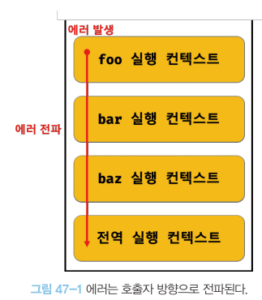

# chapter 47 : 에러 처리
## 에러 처리의 필요성
에러가 발생하지 않는 코드 작성은 불가능하다. 발생한 에러에 대해 대처하지 않고 방치하면 프로그램은 강제 종료된다.

try...catch 문을 사용해 발생한 에러에 적절하게 대응하면 프로그램이 강제 종료되지 않고 계속햇거 코드 실행이 가능하다.

## try...catch...finally 문
에러 처리 방법은 크게 두 가지가 있다.  
- querySelector나 Array#find 메서드처럼 예외적인 상황이 발생하면 반환하는 값(null 또는 -1)을 if 문이나 단축 평가 또는 옵셔널 체이닝 연산자를 통해 확인해서 처리하는 방법
- 에러 처리 코드를 미리 등록해 두고 에러가 발생하면 에러 처리 코드로 점프하도록 하는 방법  

try...catch...finally 문은 두 번째 방법으로 이 방법을 에러 처리라고 한다.

```js
try {
    // 실행할 코드
} catch (err) {
    // try 코드 블록에서 에러가 발생하면 이 코드 블록의 코드가 시행된다.
    // err에는 try 코드 블록에서 발생한 Error 객체가 전달
} finally {
    // 에러 발생과 상관없이 한 번 실행
}
```

## Error 객체
Error 생성자 함수는 에러 객체를 생성. Error 생성자 함수에는 에러를 상세히 설명하는 에러 메시지를 인수로 전달할 수 있다.
```js
const error = new Error('invalid');
```
Error 생성자 함수가 생성한 에러 객체는 message 프로퍼티와 stack 프로퍼티를 가짐.  
message : Error 생성자 함수에 인수로 전달한 에러 메시지  
stack : 에러를 발생시킨 콜스택의 호출 정보를 나타내는 문자열. (디버깅 목적)

JS의 7가지 에러는 아래와 같다. 모두 Error.prototype을 상속받는다.

| 생성자 함수 | 인스턴스 |
|:----------:|:---------:|
| Error | 일반적 에러 객체 |
| SyntaxError | 자바스크립트 문법에 맞지 않는 문을 해석할 때 발생하는 에러 객체 |
| ReferenceError | 참조할 수 없는 식별자를 참조했을 때 발생하는 에러 객체 | 
| TypeError | 피연산자 또는 인수의 데이터 타입이 유효하지 않을 때 발생하는 에러 객체 | 
| RangeError | 숫자값의 허용 범위를 벗어났을 때 발생하는 에러객체 | 
| URIError | encodeURI 또는 decodeURI 함수에 부적절한 인수를 전달했을 때 발생하는 에러 객체 | 
| EvalError | eval 함수에서 발생하는 에러 객체 |

## throw 문
Error 생성자 함수로 에러 객체를 생성한다고 에러가 발생하는 것은 아니다. 즉 에러 객체 생성과 에러 발생은 의미가 다르다.
```js
try {
    // 에러 객체를 생성한다고 에러가 발생하는 것은 아니다.
    new Error('something wrong');
} catch (error) {
    console.log(error);
}
```

에러를 발생시키려면 try 코드 블록에서 throw 문으로 에러 객체를 던져야 한다.

```js
// 외부에서 전달받은 콜백 함수를 n번만큼 반복 호출하는 코드의 에러 처리
const repeat = (n, f) => {
    // 매개변수 f에 전달된 인수가 함수가 아니면 TypeError를 발생
    if (typeof f !== 'function') throw new TypeError('f must be a function');

    for (var i = 0 ; i < n; i++) {
        f(i); //i를 전달하면서 f를 호출
    }
};

try {
    repeat(2, 1);
} catch (err) {
    console.error(err);
}
```

## 에러의 전파
에러는 호출자 방향으로 전파된다. 
즉, 콜 스택의 아래 방향(실행 중인 실행 컨택스트가 푸시되기 직전에 푸시된 실행 컨텍스트 방향)으로 전파된다. 다음 예제를 살펴보자. 

```js
// ex)
coinst foo = () => {
    throw Error('foo에서 발생한 에러'); // 4
}

const bar = () => {
    foo(); // 3
}

const baz = () => {
    bar(); // 2
}

try {
    baz();
} catch(err) {
    console.error(err);
}
```

1에서 baz 함수를 호출하면 2에서 bar함수가 호출되고 3에서 foo 함수가 호출되고 foo 함수는 4에서 에러를 throw한다. 이때 foo 함수가 throw한 에러는 다음과 같이 호출자에게 전파되어 전역에서 캐치된다.  
   

- 이 때 throw된 에러를 캐치하여 적절히 대응하면 프로그램을 강제 종료시키지 않고 코드의 실행 흐름을 복구할 수 있다. throw된 에러를 어디에서도 캐치하지 않으면 프로그램은 강제 종료된다.  
- 주의할 것은 비동기 함수인 setTimeout, 프로미스 후속 처리 메서드의 콜백 함수는 호출자가 없다는 것이다.  
- settTimeout or 프로미스 후속 처리 메서드의 콜백 함수는 태스크 큐나 마이크로태스크 큐에 일시 저장되었다가 콜 스택이 비면 이벤트 루프에 의해 콜 스택으로 푸시되어 실행. 이 때 콜 스택에 푸시된 콜백 함수의 실행 컨텍스트는 **콜 스택의 가장 하부**에 존재하게 된다. 
- 따라서 에러를 전파할 호출자가 존재하지 않는다.